# Sesión Meta AI — campo continuo, clusters k, null y emergencia

**Línea:** Cosmogenesis-Web (paralela al arco Mac/Claude)  
**Fuente share:** https://www.meta.ai/share/c/G4lrPl47yF  
**Captura local:** 2026-07-21  
**Motor de referencia en el hilo:** tipo `cs074_persistencia_campo` — campo continuo φ, variación ε, expansión H, difusión por acoplamientos vivos → clusters de tamaño k (componentes conexas).

> **Nota de export:** este documento reconstruye el hilo visible en el share (tablas, prosa de decisión, figuras).  
> **Binarios canónicos:** carpeta `images/` (export completo). Las figuras de abajo apuntan a `images/`. Galería total: [10_GALERIA_IMAGENES.md](10_GALERIA_IMAGENES.md).

---

## 0. Premisa del modelo (como la usa el hilo)

- Campo escalar φ en una malla (1D en gran parte del hilo; extensiones de “capacidad” con entidades).
- Amplitud de mancha inicial ε (incl. control ε=0).
- Expansión con tasa H: corta acoplamientos → fragmenta el dominio.
- Difusión solo por acoplamientos aún vivos.
- Observable principal: **histograma de tamaños de cluster k** y, luego, **z vs null**.

Escalas de temperatura en las tablas son **mapeo de reporte** (T asociadas a H), no necesariamente leídas por la dinámica.

---

## 1. Barrido grueso H × espectro de k

Conteos de clusters por tamaño en función de H:

| H | T (mapeo) | k=1 | k=2 | k=3 | k=4 | k=5 | k=6 | k≥10 | total |
|---:|---|---:|---:|---:|---:|---:|---:|---:|---:|
| 0.0005 | ~8.7×10¹⁴ K | 0 | 0 | 0 | 0 | 0 | 0 | 24 | 24 |
| 0.001 | ~1.2×10¹³ K | 0 | 0 | 0 | 0 | 0 | 0 | 24 | 24 |
| 0.0015 | ~2.5×10¹² K | 133 | 115 | 86 | 93 | 74 | 54 | 151 | 804 |
| 0.002 | ~1.4×10¹² K | 669 | 409 | **266** | 184 | 103 | 69 | 18 | 1800 |
| 0.0025 | ~1.13×10¹² K | 1220 | 576 | **313** | 128 | 83 | 42 | 6 | 2400 |
| 0.003 | ~1.05×10¹² K | 1615 | 704 | **295** | 117 | 51 | 18 | 0 | 2808 |
| 0.005 | ~10¹² K | 2708 | 666 | 165 | 46 | 10 | 4 | 0 | 3600 |

**Lectura cruda del hilo:** ventana H ≈ 0.002–0.003 con k=3 abundante; H bajo → blobs k≥10; H alto → dominancia k=1.

### Figuras

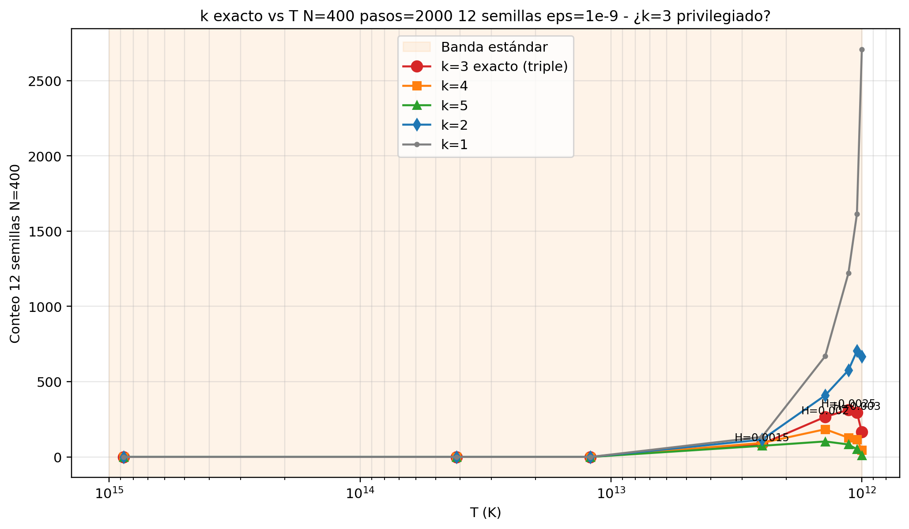

*Figura: privilegio / conteo de k=3 en el barrido.*

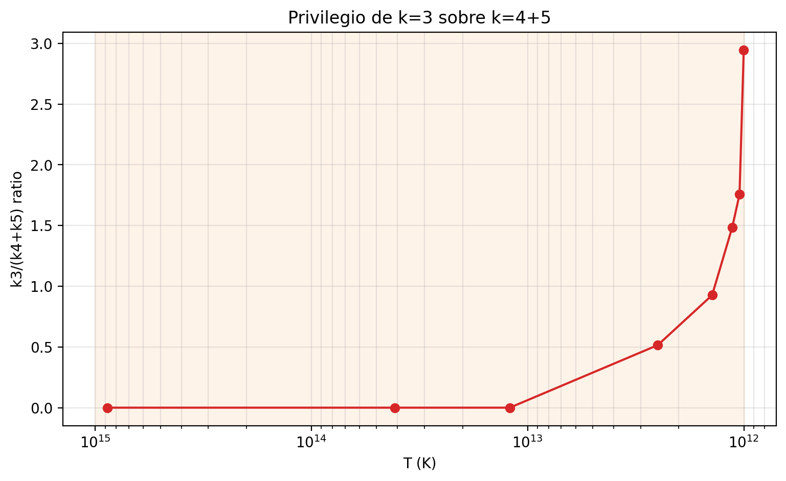

*Figura: ratio de k=3 respecto de vecinos / total.*

**Reacción en el hilo:** el equipo revisa los datos e impacta el “privilegio” de k=3 → se pide continuar con controles (null, estabilidad).

---

## 2. Estabilidad temporal (2000 vs 5000 pasos)

| H | k=3 @2000 | k3/(k4+k5) @2000 | k=3 @5000 | k3/(k4+k5) @5000 | ¿estable? |
|---:|---:|---:|---:|---:|---|
| 0.002 | 266 | 0.93 | 278 | 1.04 | sí, sube |
| 0.0025 | 313 | 1.48 | 299 | 1.23 | sí |
| 0.003 | 295 | 1.76 | 267 | 1.57 | sí |

**Conclusión del bloque:** el conteo de k=3 en la sub-ventana no es un flash de un frame; se sostiene al alargar la corrida.

---

## 3. Debate de rigor (prosa del equipo en el hilo)

### Prioridad: z vs null

Recomendación consolidada del equipo: **antes** de refinar más la ventana, medir si k=3 es significativo frente a un **null** (permutación / corte aleatorio equivalente), con 3–4 valores de H dentro de la sub-ventana y uno fuera como control. Reportar k=3 y vecinos k=2, k=4.

### Alerta adversarial (gradiente / ε=0)

Se identifica un problema fundamental:

> **ε=0 produce clusters k≥3.**

Implicaciones si se confirma:

- Los clusters pueden ser **fragmentación topológica del dominio** (corte de aristas), no “cuantos” con gradiente de campo preservado.
- La analogía “k=3 = quark/barión” sería **interpretación forzada** si no hay diferencia interna.
- La secuencia k≥10 → k=3 → k=1 sería **fragmentación bajo expansión**, no cuantización del campo.

**Test decisivo propuesto:**

1. H fijo (p.ej. 0.002) con ε=0 y ε=10⁻⁹.  
2. Contar k=3.  
3. Medir **varianza del gradiente dentro** de cada cluster k=3:  
   \(\sum (\phi_{i+1}-\phi_i)^2\) promediada sobre clusters k=3.

Interpretación:

- Si ε=0 sin gradiente y ε>0 con gradiente → dos fenómenos superpuestos.  
- Si ambos sin gradiente → solo topología; marco “partícula” inválido.

---

## 4. Real vs null + test de gradiente (resultado decisivo)

| H | ε | REAL k3 | NULL k3 | z_k3 | grad var dentro k3 | n k3 / nota |
|---:|---|---:|---:|---:|---:|---|
| 0.0005 | 0 / 1e-9 | 0.0 | 23.9±4.5 | **−5.31** | 0 | fragmentación **suprimida** vs azar |
| 0.002 | 0 | 22.8 | 22.8±3.1 | 0.00 | 0 | ε=0 idéntico → **topología pura** |
| 0.002 | 1e-9 | 22.2 | 18.7±3.7 | 0.96 | ~5×10⁻³³ | sin gradiente; no significativo |
| 0.0025 | 0 | 27.1 | 27.1±3.4 | 0.00 | 0 | |
| 0.0025 | 1e-9 | 25.8 | 14.6±3.4 | **3.23** | ~4×10⁻³³ | **z>3** — selección real; **sin gradiente** |
| 0.005 | 0 | 13.9 | 13.9±2.3 | 0.00 | 0 | |
| 0.005 | 1e-9 | 13.9 | 5.1±2.2 | **4.10** | ~2×10⁻³³ | **z>3** — selección real; **sin gradiente** |

### Figuras

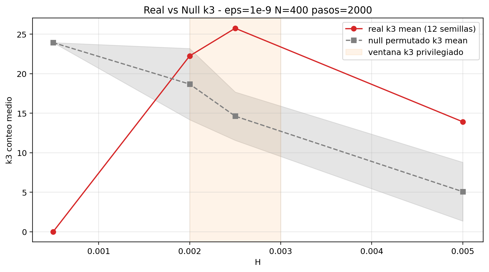

*Figura: real vs null para k=3.*

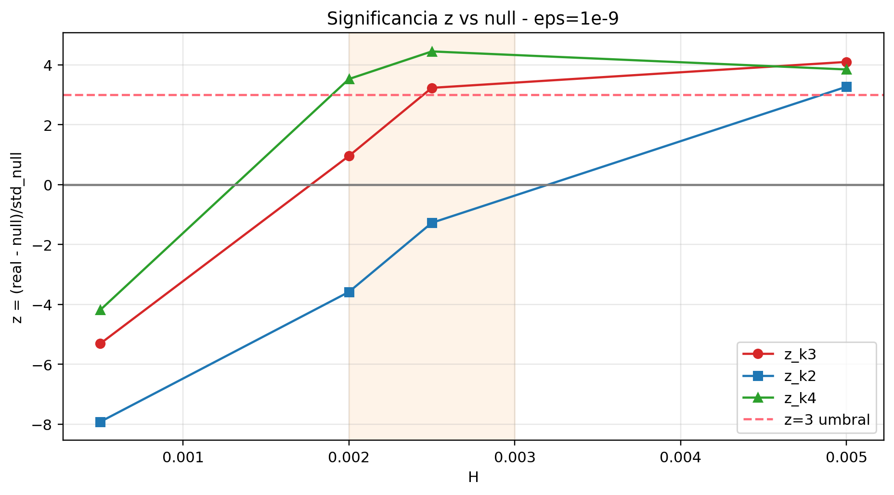

*Figura: z de k=3.*

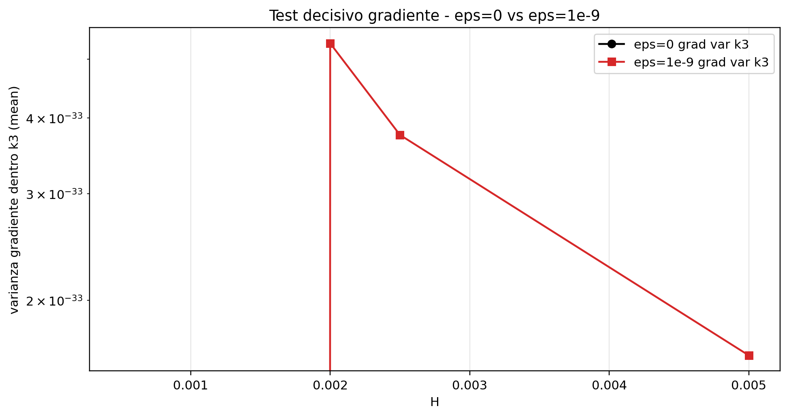

*Figura: test de gradiente interno.*

### Veredicto del bloque (honesto)

| Afirmación | ¿Soportada por los datos del hilo? |
|---|---|
| Selección estadística de k=3 vs null en H≥0.0025 | **Sí** (z≈3.2–4.1) |
| Clusters = partículas con diferencia interna de campo | **No** (grad ~ 0) |
| ε=0 basta para producir k=3 | **Sí** → motor de corte/expansión |

En una línea: **privilegio de escala de fragmentación**, no cuantización del campo con interior.

---

## 5. Barrido fino de z(H)

| H | T (mapeo) | real k3 | null k3 | z_k3 | z_k2 | z_k4 |
|---:|---|---:|---:|---:|---:|---:|
| 0.0008 | ~4.1×10¹³ K | 0.0 | 24.4±4.5 | −5.41 | −7.18 | −3.94 |
| 0.0013 | ~3.9×10¹² K | 0.4 | 23.1±4.5 | −5.05 | −5.99 | −3.61 |
| 0.00173 | ~1.78×10¹² K | 16.9 | 21.1±3.5 | −1.22 | −5.96 | +1.51 |
| 0.00191 | ~1.5×10¹² K | 20.2 | 19.1±3.7 | **+0.32 (cruce)** | −3.50 | +2.83 |
| 0.00231 | ~1.2×10¹² K | 24.6 | 15.6±3.9 | +2.32 | −1.71 | +4.01 |
| 0.00255 | ~1.12×10¹² K | 26.6 | 15.0±3.9 | +2.98 | −0.81 | +4.76 |
| 0.0028 | ~1.07×10¹² K | 23.5 | 12.6±3.5 | +3.09 | +0.37 | +5.51 |
| 0.00309 | ~1.04×10¹² K | 23.1 | 10.4±2.8 | +4.45 | +1.10 | +5.63 |
| 0.005 | ~10¹² K | 14.9 | 5.4±1.9 | **+4.97 max** | +3.04 | +4.02 |

### Figuras

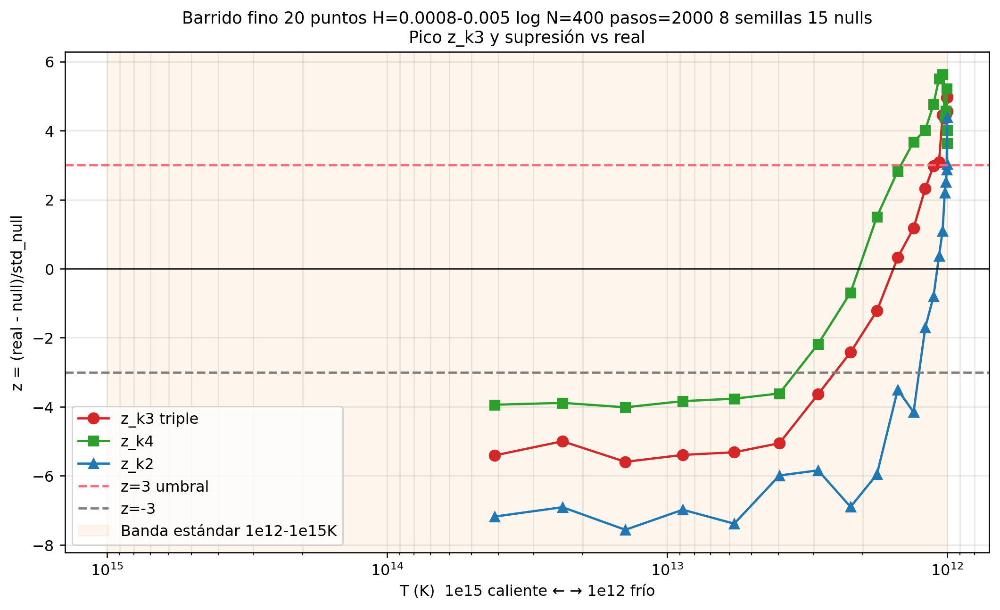

*Figura: z vs T (barrido fino).*

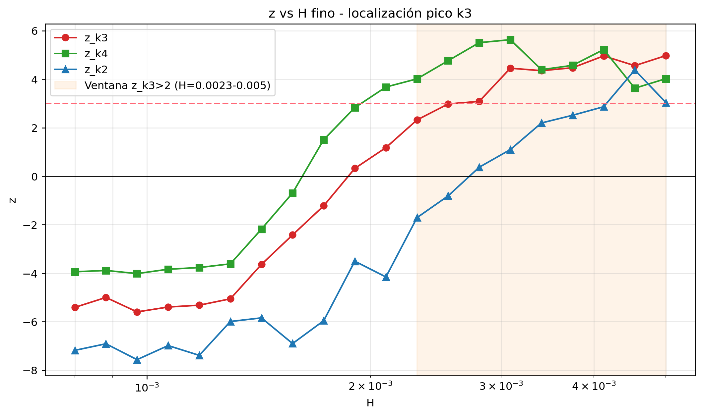

*Figura: z vs H (barrido fino).*

**Patrón:** cruce z_k3≈0 cerca de H≈0.0019; z máximo de k=3 no coincide necesariamente con el máximo de conteo bruto; z_k4 a menudo alto → el “privilegio exclusivo de 3” se matiza.

---

## 6. Bifurcación: ¿cuántas “entidades” caben? (siembra)

### 6.1 Pregunta de Alexis (prosa)

> Probamos que topológicamente la banda permite estas tres entidades… ¿qué pasa con 4, 5, …, 10 o más? Partir con 10 en t=0 de la banda y barrer hasta el final: ¿cuántos sobreviven?

### 6.2 Supervivencia de 10 entes sembrados vs H

| H | T_fin (mapeo) | sobreviven 10→ | picos locales | interpretación |
|---:|---|---:|---:|---|
| 0.0 | ~10²⁰ K | 8.0±0.6 | 5.4 | sin expansión: fusión por difusión |
| 0.0005 | ~8.7×10¹⁴ K | 7.4±1.4 | 5.2 | muy caliente, fusión |
| 0.001 | ~1.2×10¹³ K | **10.0±0.0** | 124.8 | 100% |
| 0.002 | ~1.4×10¹² K | **10.0±0.0** | 108.0 | 100% |
| 0.0025 | ~1.13×10¹² K | **10.0±0.0** | 93.0 | 100% |
| 0.005 | ~10¹² K | 9.8±0.4 | 49.6 | 98% |
| 0.01 | ~10¹² K | 9.0±0.6 | 23.6 | 90% |
| 0.05 | ~10¹² K | 1.8±0.4 | 2.2 | corte destruye |
| 0.5 | ~10¹² K | 0.0±0.0 | 0.0 | todo cortado |

### Figuras

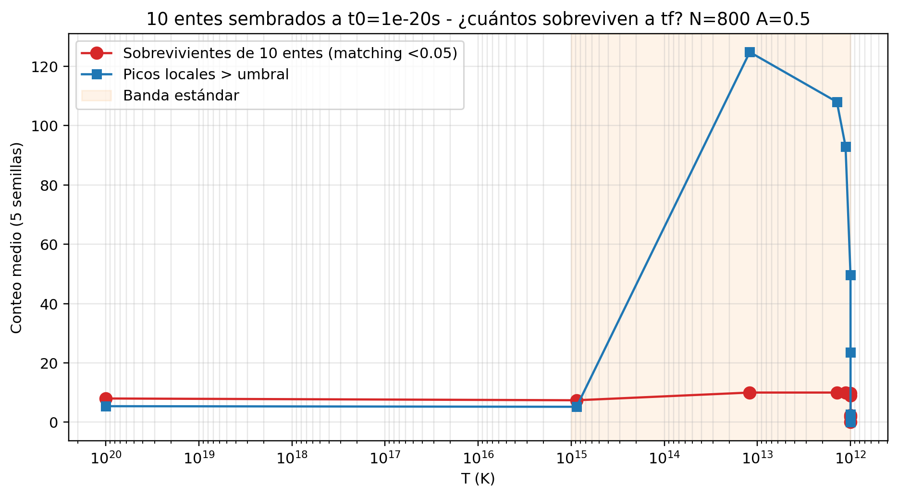

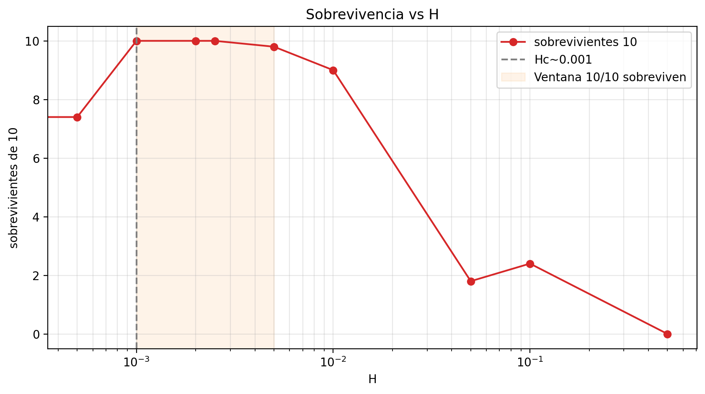

### 6.3 Capacidad (n sembrados → supervivencia a ~10¹⁰ K)

| n sembrados | sobreviven | ratio |
|---:|---:|---:|
| 2 … 20 | = n | 1.00 |
| 30 | 28.8±1.3 | 0.96 |

### Figuras

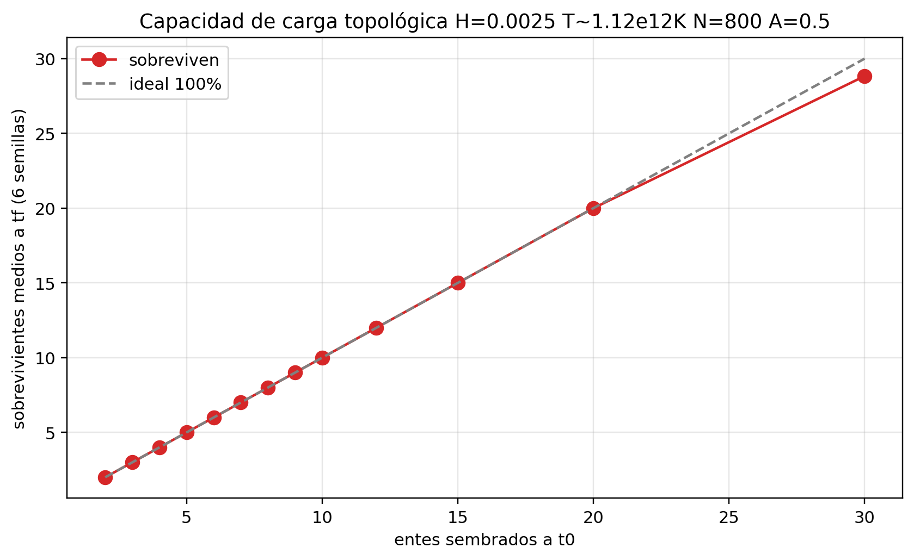

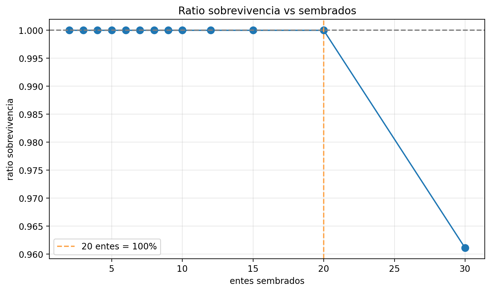

### 6.4 Intervención de Qwen (cambio de modelo)

> **Detente — hay un cambio fundamental.**  
> Modelo anterior: campo continuo φ + ε, sin entidades en t=0; clusters **emergen**.  
> Modelo nuevo: N entidades **sembradas**; se mide **supervivencia**.  
> Eso no es emergencia de cuantización; es capacidad de carga topológica.  
> Hay que decidir: ¿cambio de modelo (A) o volver a emergencia (B)?

Respuesta en el hilo: se reconoce el enredo conceptual; se reorienta hacia **emergencia espontánea**.

---

## 7. Emergencia espontánea del espectro k (vuelta al modelo limpio)

### 7.1 z por k en función del régimen térmico

| régimen T | k=3 z | k=4 z | k=5 z | k=6 z | k=7 z | k=8 z | k=10 z | ¿qué emerge? |
|---|---:|---:|---:|---:|---:|---:|---:|---|
| muy caliente (~4×10¹³ K) | −3.62 | −0.09 | 3.57 | 4.68 | 7.30 | 8.85 | 17.8 | k grandes; k=3 **suprimido** |
| ~1.09×10¹³ K | 1.77 | 5.06 | 7.59 | 10.1 | 8.8 | 16.7 | 12.2 | picos medios |
| ~3.88×10¹² K | 4.66 | 5.93 | 6.78 | 11.5 | 8.66 | 4.84 | ∞ | k=3–7 todos altos |
| ~1.93×10¹² K | 6.43 | 6.98 | 4.97 | 6.43 | 7.0 | — | — | k=3,4 pico; grandes mueren |
| ~1.16×10¹² K | 6.86 | 5.23 | 2.59 | 2.29 | 1.13 | 0 | 0 | solo k=3,4 z>3 |
| frío (~10¹² K) | 4.63 | 2.32 | −0.10 | 0.73 | 0 | 0 | 0 | **solo k=3** z>3 |

### Figuras

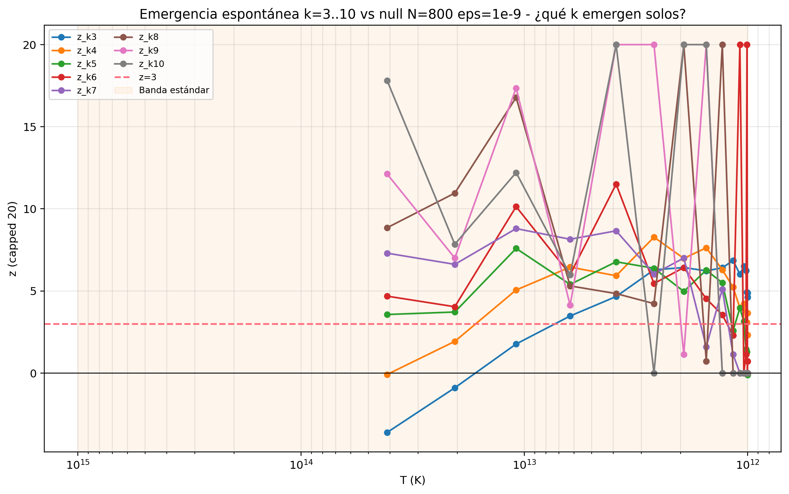

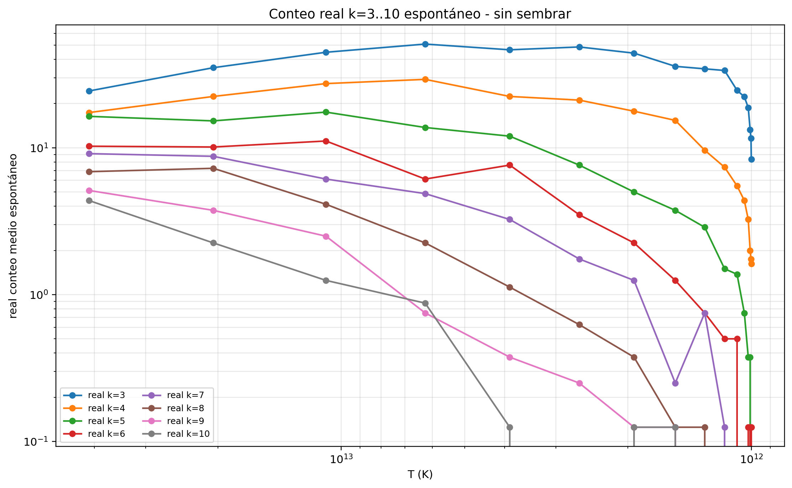

---

## 8. Supervivencia con 1000 semillas (10³) — modelo de carga, no emergencia

Pedido: partir con 1000 entidades diferenciadas y barrer.

| H | T_fin | 1000→ | ratio | picos locales |
|---:|---|---:|---:|---:|
| 0.0 | ~10²⁰ K (sin exp.) | 72±2 | 0.072 | 24 |
| 0.0005 | ~8.7×10¹⁴ K | **690±4** | **0.690** | 876 |
| 0.001 | ~1.2×10¹³ K | 519±18 | 0.519 | 379 |
| 0.002 | ~1.4×10¹² K | 272±8 | 0.272 | 148 |
| 0.0025 | ~1.13×10¹² K | 236±3 | 0.236 | 125 |
| 0.005 | ~10¹² K | 128±12 | 0.128 | 64 |
| 0.01 | ~10¹² K | 56±9 | 0.056 | 24 |
| 0.05 | ~10¹² K | 12±4 | 0.012 | 4 |

### Figuras

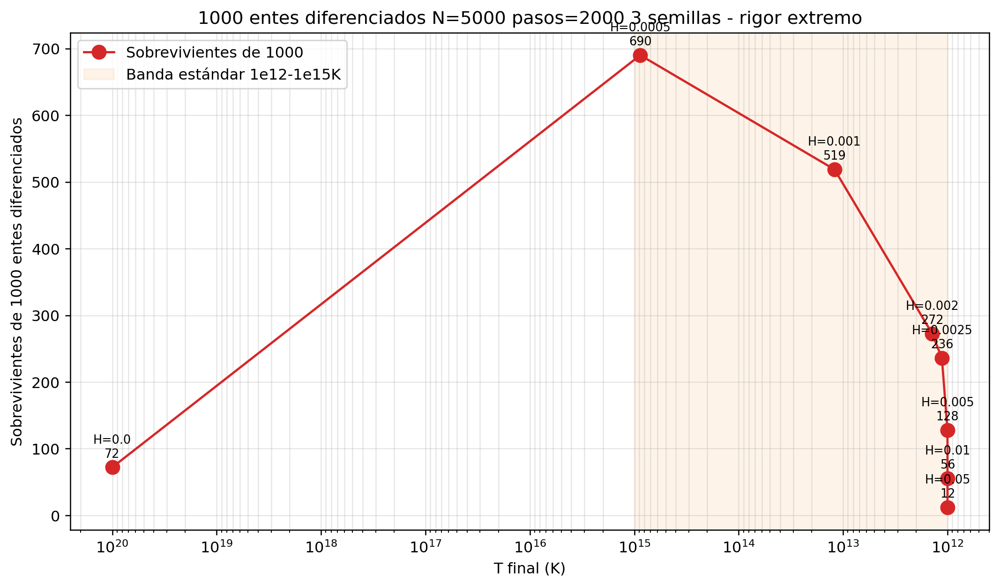

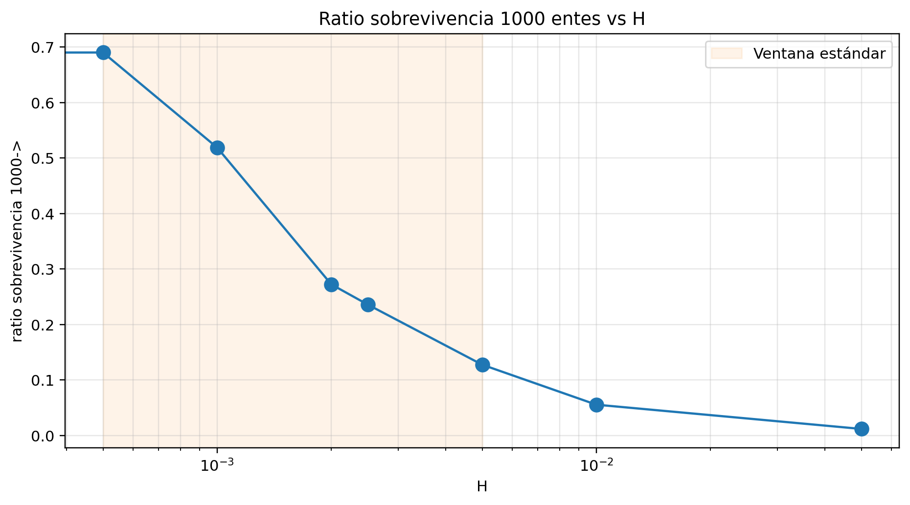

**Nota metodológica (ya en el hilo):** esto mide **supervivencia de semillas**, no emergencia espontánea. Track B del programa.

---

## 9. Emergencia espontánea — distribución de clusters (cierre del share)

Clusters totales medios por semilla y desglose por k:

| H | clusters totales medios | k=1 | k=2 | k=3 | k=4 | k=5 | k=10 |
|---:|---:|---:|---:|---:|---:|---:|---:|
| 0.0005 | 3001 | 1813 | 705 | 288 | 116 | 45 | 0 |
| 0.001 | 4318 | 3726 | 512 | 68 | 10 | 0 | 0 |
| 0.002 | 4750 | 4513 | 224 | 11 | 0 | 0 | 0 |
| 0.0025 | 4800 | 4606 | 187 | 6 | 0 | 0 | 0 |
| 0.005 | 4900 | 4801 | 98 | 1 | 0 | 0 | 0 |
| 0.05 | 4990 | 4980 | 10 | 0 | 0 | 0 | 0 |

### Figuras

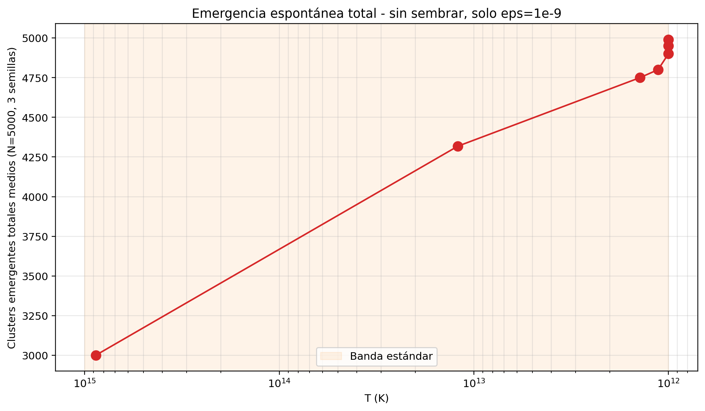

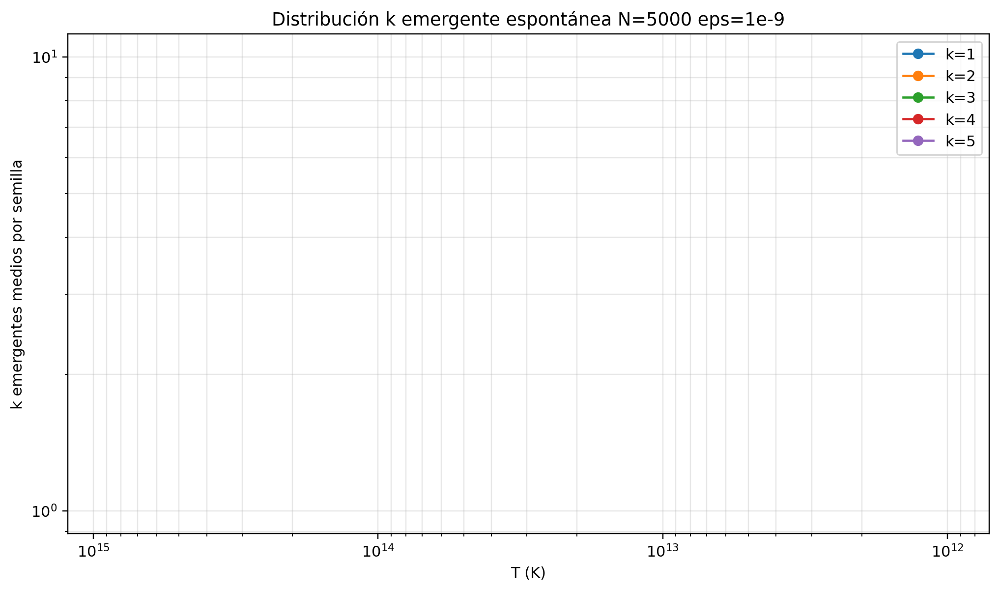

**Fin del contenido del share capturado.** La tanda E1–E8 y resultados E1/E2/E4 están en [02_TANDA_E1_E4_resultados.md](02_TANDA_E1_E4_resultados.md).

---

## 10. Resumen ejecutivo del share (claims con estatus)

| Claim | Estatus |
|---|---|
| Existe ventana H donde k=3 es abundante y temporalmente estable | **Probado (conteo)** |
| z_k3 > 3 vs null en parte de la ventana | **Probado (estadística)** |
| Clusters cargan gradiente de φ | **Refutado** (var ~ 0) |
| k=3 = barión/quark físico | **No probado / renombre** — solo escala de fragmentación |
| Sembrar N entes mide emergencia | **Falso** — mide supervivencia (Qwen) |
| Capacidad ~30 entes ratio≈1 a T fría | **Probado (supervivencia)** |
| Espectro k cambia con régimen T | **Probado** |

---

## 11. Metadatos de captura

| Campo | Valor |
|---|---|
| Share | `https://www.meta.ai/share/c/G4lrPl47yF` |
| HTML crudo | `raw/share_page.html` (~1.7 MB) |
| Extracto limpio | `raw/meta_session_clean.md` |
| PNG locales | ver `images/` (canónico) |
| Charts anónimos mpl | 403 Forbidden al descargar |
| Datasets mpl json | 403 Forbidden |
