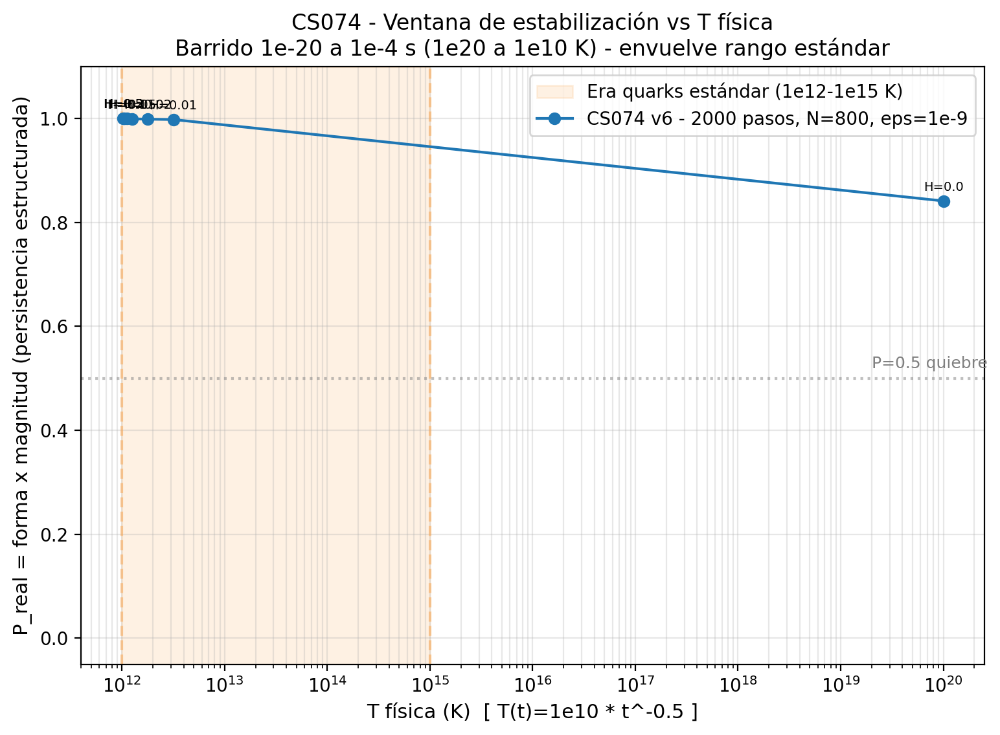
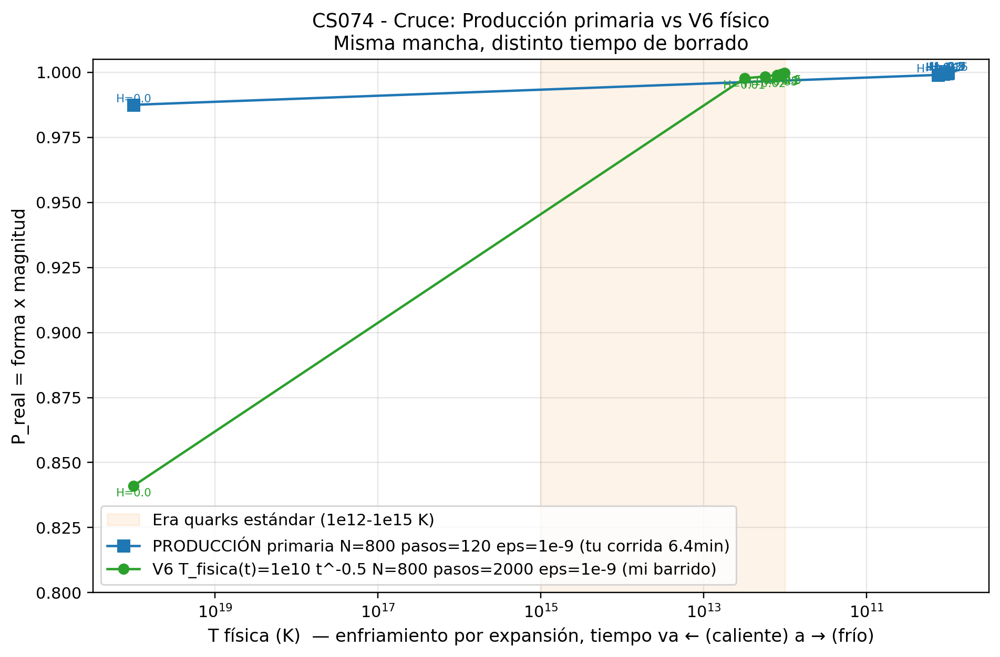
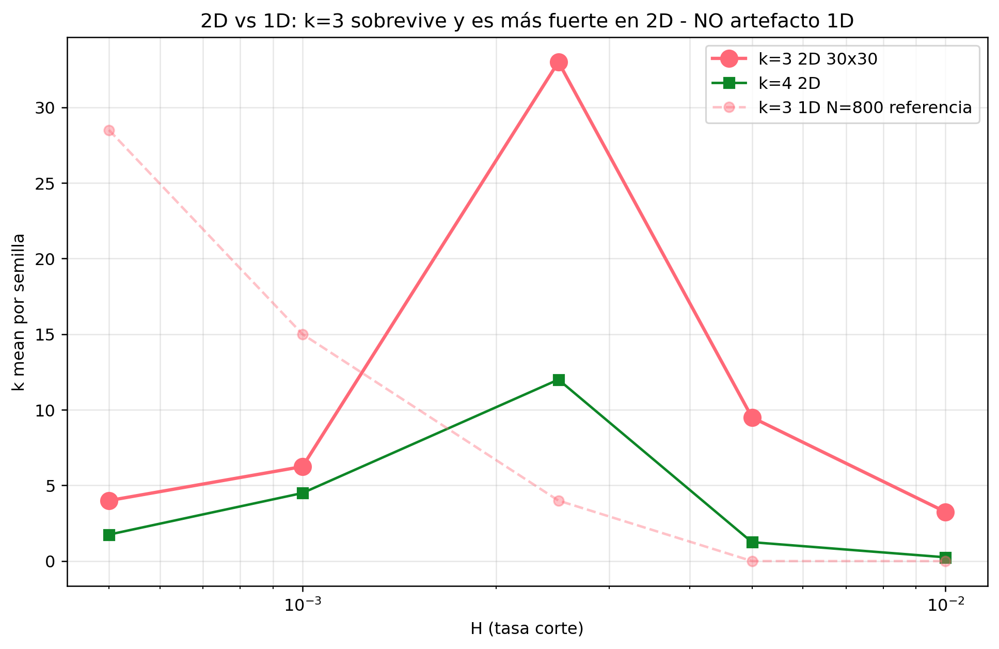
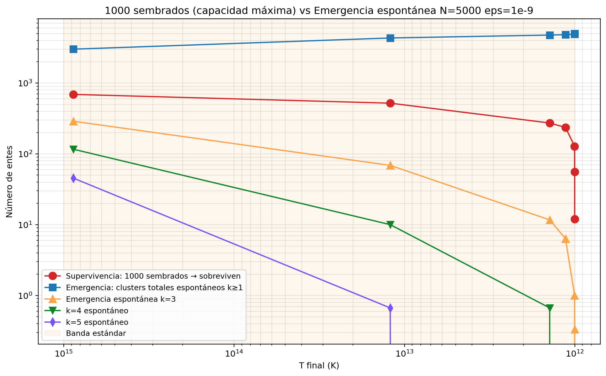
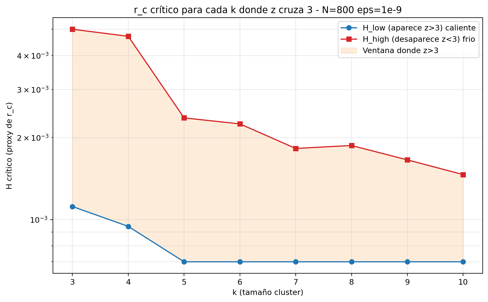
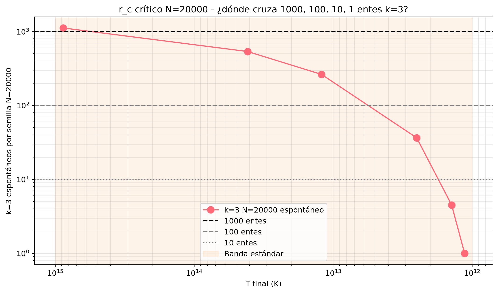

# 04 — Instrumento CS074 y clusters (1D → controles)

**Fuente:** PDF sesión Web + share Meta + corrida local conocida  
**Binarios canónicos:** `images/` (58 PNG + JSON/CSV) — ver [10_GALERIA_IMAGENES.md](10_GALERIA_IMAGENES.md)  
**Detalle de tablas del share:** [01_SESION_META_campo_clusters.md](01_SESION_META_campo_clusters.md)

---

## 1. Instrumento

| Campo | Valor |
|-------|--------|
| Script | `cs074_persistencia_campo.py` |
| Premisa | Campo φ, mancha ε, expansión H, difusión por acoplamientos **vivos** |
| Nota deliberada | Expandir **corta** el canal de difusión entre regiones separadas |
| Producción (Mac, entrega cruda) | N=800, pasos=120, semillas=12; ε×H grilla 8×8 = 64 filas |
| Recursos (corrida conocida) | ~383 s real, ~28.6 MiB RSS, EXIT 0 |
| SHA256 script (reporte) | `5017f28c…cfa7441c` |
| Artefactos nombrados | `cs074_produccion_resultado_crudo.json`, `cs074_produccion_meta.txt` |

**Estatus:** corrida de producción **ejecutada**; adjudicación de “persiste / no persiste” como curva es del director del experimento (CS en Mac; en Web se continúa con otros observables).

---

## 2. Línea de clusters k (lo que el share documenta bien)

### 2.1 Barrido H × espectro k

Ventana **H ≈ 0.002–0.003**: k=3 abundante; H bajo → k≥10; H alto → k=1.

### 2.2 Estabilidad 2000 → 5000 pasos

k=3 se sostiene en la sub-ventana (no es un frame suelto).

### 2.3 Real vs null + gradiente (decisivo)

| Resultado | Estatus |
|-----------|---------|
| z_k3 > 3 en H≥0.0025 (ε>0) | **Probado (estadística)** |
| Gradiente interno en k=3 ~ 0 | **Refutado el “cuanto con interior”** |
| ε=0 produce k=3 | **Topología de corte**, no solo mancha ε |

### 2.4 Barrido fino z(H)

Cruce z_k3≈0 cerca de H≈0.0019; z max no = conteo max; z_k4 a menudo alto.

### 2.5 Siembra vs emergencia (Qwen)

| Track | Qué mide |
|-------|----------|
| **A — emergencia** | Campo + ε → distribución de k |
| **B — supervivencia** | N entes sembrados → cuántos quedan |

Sembrar 10 / 30 / 1000 mide **capacidad de carga**, no cuantización espontánea.

### 2.6 Emergencia espontánea (cierre del share)

Espectro k cambia con régimen T; en frío solo k=3 mantiene z>3 en el relato del hilo.

---

## 3. Datos crudos en `images/`

JSON/CSV/scripts del export Meta: ver [MANIFEST_IMAGES.md](MANIFEST_IMAGES.md).  
Galería completa: [10_GALERIA_IMAGENES.md](10_GALERIA_IMAGENES.md).

---

## 4. Claims de este tramo (libro único)

| ID | Claim | Estatus |
|----|-------|---------|
| W-01 | Persistencia de diferencia exige ε≠0 + expansión que gana a la interacción | **Marco + indicios** (curva CS074 / controles) |
| W-02 | Existe ventana H con k=3 estable en conteo | **Probado (conteo)** |
| W-03 | k=3 supera null (z>3) en parte de la ventana | **Probado (estadística)** |
| W-04 | k=3 carga gradiente de φ | **Refutado** |
| W-05 | k=3 = barión/quark | **No probado** (renombre) |
| W-06 | Sembrar N mide emergencia de cuantos | **Falso** (track B) |

→ Siguiente: [05_FASE2_CARGA_CONFINAMIENTO.md](05_FASE2_CARGA_CONFINAMIENTO.md)
