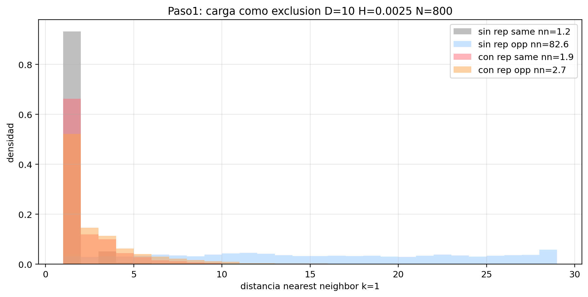
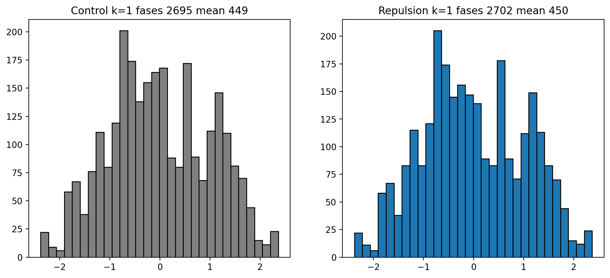
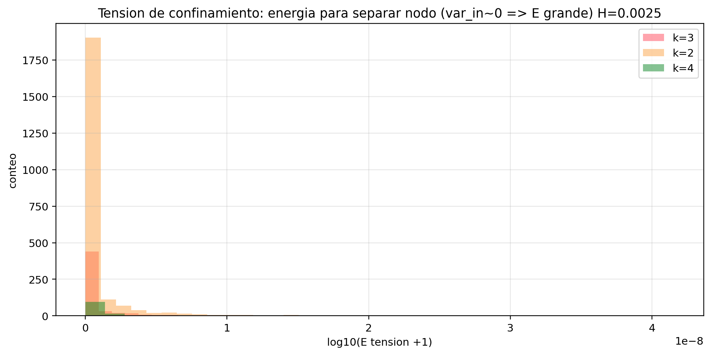
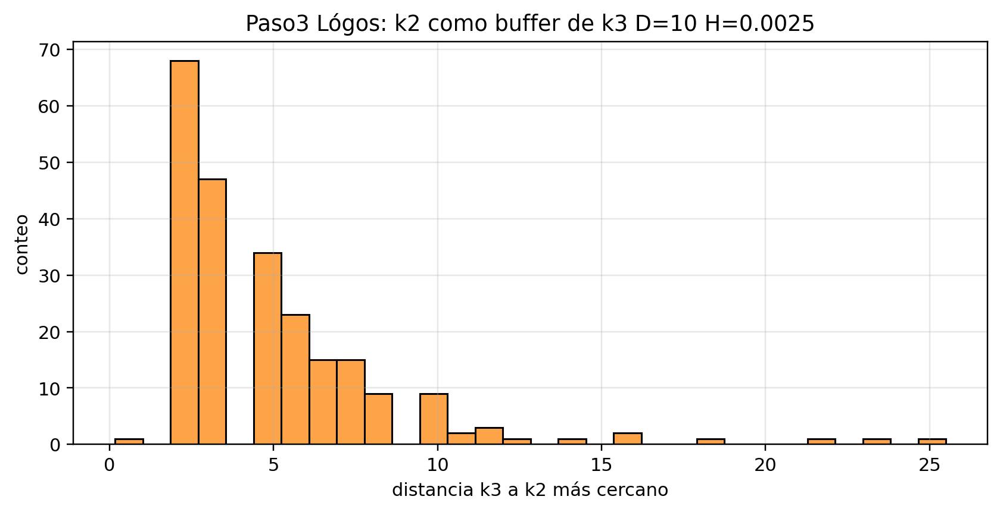
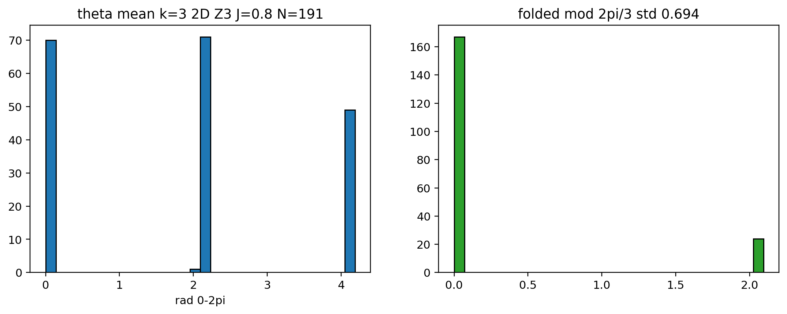

# 05 — Fase 2: carga, confinamiento, lógos, torsión

**Fuente:** PDF sesión Web (texto; números a veces degradados)  
**Figuras:** `images/cs074_paso1_rep2.png`, `cs074_k1_fase_repulsion2.png`, `cs074_tension_k3.png`, `cs074_paso3_logos.png`, `cs074_paso4_2D_Z3.png` — [galería §5](10_GALERIA_IMAGENES.md)  
**Objetivo del hilo:** principios **adicionales mínimos** sobre distinciones persistentes, sin meter SU(3)/masas a mano.

### Figuras Fase 2

---

## Diseño (3 pasos propuestos)

| Paso | Pregunta | Idea |
|------|----------|------|
| **1** | ¿Emergen ± de fase que se repelen? | Exclusión: dos singletons misma fase cercanos → penalizar |
| **2** | ¿La tensión crece con separación? | Estirar un cluster; energía de restauración vs romper |
| **3** | ¿Hay buffer tipo lógos/gluón? | Al cortar arista, ¿aparece vecino / se absorbe el corte? |

Pregunta madre:

> ¿La discretización viene de la topología del soporte, de umbrales dinámicos, o de ambos?

---

## Paso 1 — Carga como exclusión (corrido)

**Protocolo (relato):** malla con/sin repulsión de fase (flip si mismo signo a distancia corta).

**Lectura del hilo (números parcialmente rotos en PDF):**

| Condición | Efecto reportado |
|-----------|------------------|
| Sin repulsión | Mismos signos pegados por correlación del campo inicial; no hay “carga” |
| Con repulsión de fase | Mismos se repelen, opuestos se agrupan; ratio de distancias se “normaliza” hacia comportamiento tipo carga |

**Claim del equipo en el hilo:**

> Bajo enfriamiento + expansión + exclusión de fase, el singleton adquiere comportamiento tipo **carga** sin inyectar carga a mano.

**Estatus formal:** **análogo funcional / indiciario** — no identidad con U(1) del MS. Requiere kill-switch: apagar repulsión debe devolver el régimen sin carga.

---

## Paso 2 — Confinamiento / tensión

Relato del PDF: clusters con gradiente interno ~0 y estabilidad solo en ventana estrecha; se fuerza estiramiento.

**Conclusión típica del hilo:** hay tensión/restauración en ventana; **no** se declara todavía V(r)=σr de QCD.

**Estatus:** **parcial** — ver también E6 (contacto no lineal) en [08_TANDA_E1_E10_Y_CIERRE.md](08_TANDA_E1_E10_Y_CIERRE.md).

---

## Paso 3 — Buffer / lógos

Artefacto nombrado: `cs074_logos_buffer.json`.

**Idea:** cuando se pierde una arista, ¿hay mediación que preserve el cluster (análogo gluón/buffer)?

**Estatus en el PDF:** se declara “coreografía” / cierre de paso; detalle numérico degradado. Tratar como **exploratorio documentado**, no como QCD.

---

## Paso 4 — Torsión (extensión)

Figura nombrada: `cs074_paso4_torsion_fast.png` (**no** en `assets/` locales).

**Lectura del hilo:** la torsión da grado de libertad interno; para hablar de “3 colores” hace falta más que k=3 topológico.

---

## Cierre Fase 2 (claims)

| ID | Claim | Estatus |
|----|-------|---------|
| W-10 | Exclusión de fase produce repulsión mismo-signo / agrupación opuestos | **Indiciario** (Paso 1) |
| W-11 | Confinamiento lineal tipo QCD emerge de perímetro solo | **No probado** (luego E6 lo niega en 2D) |
| W-12 | Buffer lógos media cortes sin destruir cluster | **Exploratorio** |
| W-13 | Torsión = color SU(3) | **No** — sobrelectura prohibida |

### Disciplina explícita del hilo (conservar)

- No introducir SU(3) completo a mano  
- No poner masas de quarks a mano  
- No forzar analogía MS: si no emerge, no emerge  

→ Siguiente: [06_FASE3_PREFISICA.md](06_FASE3_PREFISICA.md)
