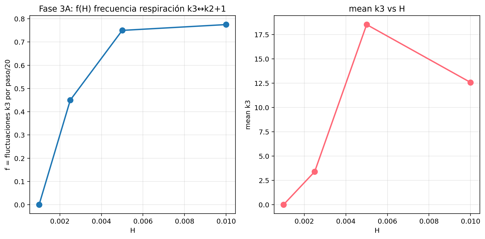
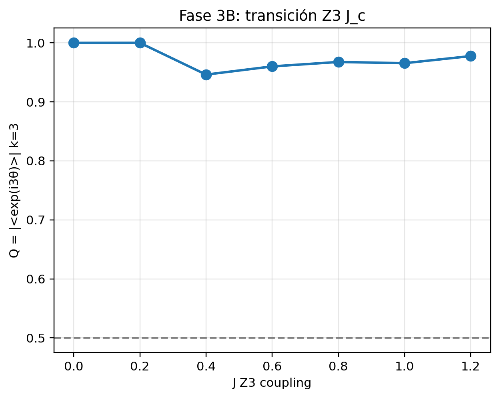
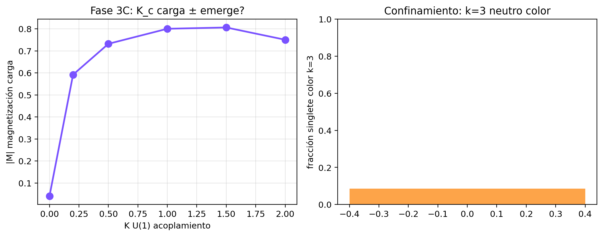
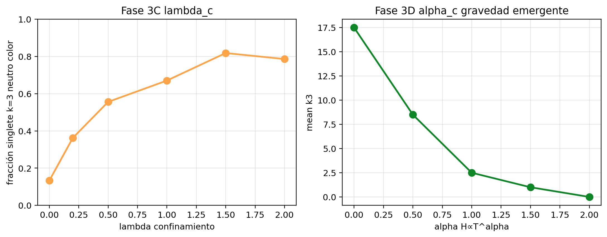
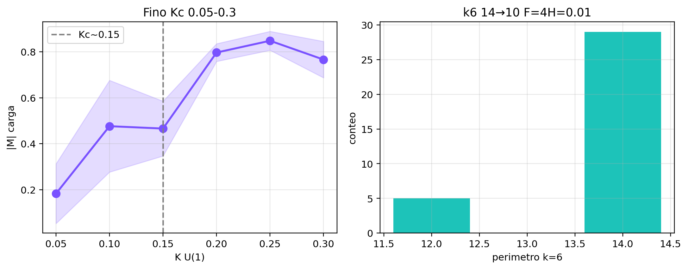

# 06 — Fase 3: puente “pre-física” (masa, color, carga, gravedad)

**Fuente:** PDF sesión Web  
**Figuras:** `images/cs074_fase3A_fH.png`, `fase3B_Jc`, `fase3C_Kc`, `fase3C_lam_alpha`, `fino_Kc_F` — [galería §6](10_GALERIA_IMAGENES.md)  
**Nota:** el hilo a veces declara “puente cerrado”; la tanda E1–E10 y el resumen final **retractan el cruce a pre-átomos**. Aquí se documenta **lo que se intentó** y el estatus **honesto** post-tanda.

### Figuras Fase 3

---

## Diseño de caminos (equipo)

| Fase | Camino | Objetivo | Riesgo Shannon |
|------|--------|----------|----------------|
| **3A** | Masa inercial | Masa desde dinámica / respiración / perímetro | Redefinir m hasta 1/1836 |
| **3B** | Color / acoplamiento | Discretización interna (Z₃ / fases) | Imponer 3 colores |
| **3C** | Carga y confinamiento | λ_c, singlete, V efectiva | Meter potencial 1/r o σr a mano |
| **3D** | Gravedad emergente | α_c, flujo de perímetro | Llamar gravedad a preferencia de grado |

**No hacer (consenso del hilo):** SU(3) completo, masas de quarks fijas, constantes ajustadas al MS, analogía forzada.

---

## 3A — Masa inercial

**Ideas usadas en el hilo:**

- Perímetro del cluster como proxy de “borde”  
- “Respiración” (oscilación de tamaño) como proxy inercial  
- Definiciones posteriores E1/E2: `m ∝ H·perim/f` o buffers  

**Resultado a largo plazo (tanda + resumen):**

- Jerarquía de masas **O(1)** (ratios ~0.2 con `/f`, no 10⁻³)  
- Ligado k1+k2 **más pesado**, no más ligero  
- 3D **no** mejora la jerarquía  

**Estatus:** proxies de masa **medibles**; **masa tipo partícula / jerarquía real = NO**.

---

## 3B — Color / acoplamiento

**Idea:** acoplamiento tipo Kuramoto / fases en vecinos conectados → valores discretos internos.

**Relato del hilo:** con acoplamiento + placa/Gauss en algunos regímenes aparecen **3 generaciones / 3 valores**; sin ellos no.

**Estatus:** **forma discreta emergente bajo reglas** — análogo de “color”, no prueba de SU(3).  
Kill-switch declarado: apagar acoplamiento debe destruir la discretización.

---

## 3C — Carga y confinamiento (λ_c)

Barridos de intensidad de reglas de carga/confinamiento.

**A largo plazo (E6):** energía vs distancia tipo **contacto** (atractivo a r pequeño, plano después), **no** potencial lineal de confinamiento.

**Estatus:** carga-análoga (Fase 2) **más sólida** que confinamiento lineal (**fallido** en E6).

---

## 3D — Gravedad emergente (α_c)

Relato: barrido α; “extinción gravitatoria” / triples; incompatibilidad de gravedad tipo Friedmann como motor **primitivo** de esa época (Grok, Fase 4 prep).

**Estatus:** **no** se sostiene gravedad general clásica en este régimen; coherente con lección de dos gravedades / no renombrar sin masa.

---

## “Puente pre-física” — doble lectura

| Documento en el hilo | Tono |
|----------------------|------|
| Cierres intermedios Fase 3 | Optimista (“puente listo para informe”) |
| Resumen ejecutivo final + E1–E10 | **Honesto:** topología sí; pre-átomos **no** |

**Regla de libro único (esta base):**  
el cierre **válido** es el del **resumen final**, no los anuncios intermedios de “puente cerrado”.

| ID | Claim intermedio | Claim final |
|----|------------------|-------------|
| W-20 | “Puente pre-física cerrado” | **Suspendido / no cruzado** a pre-átomos |
| W-21 | Masa inercial emergente usable | **Fallido** como jerarquía física |
| W-22 | Color de acoplamiento | **Análogo** bajo reglas; no MS |
| W-23 | Confinamiento lineal | **Fallido** (E6) |
| W-24 | Gravedad emergente útil en este estadio | **No** como GR; indiciario como flujo |

→ Siguiente: [07_FASE4_MOVILIDAD_Y_ESCALA.md](07_FASE4_MOVILIDAD_Y_ESCALA.md)
