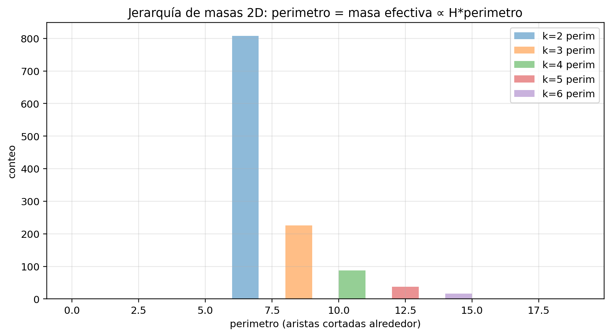
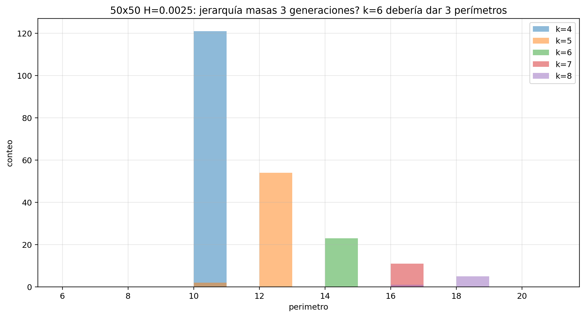
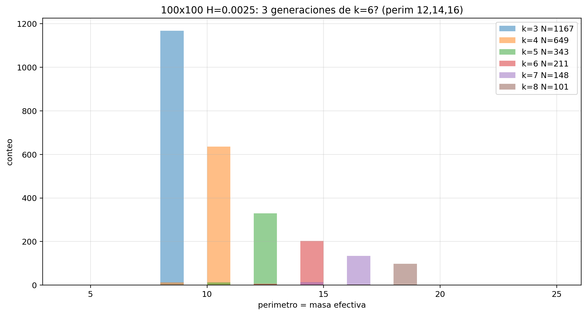

# 07 — Fase 4: movilidad, escalabilidad, nulls, ratios

**Fuente:** PDF sesión Web  
**Figuras de masas/escala:** `images/cs074_jerarquia_masas_perim.png`, `cs074_50x50_masas.png`, `cs074_100x100_masas.png` — [galería §7](10_GALERIA_IMAGENES.md)  
**Rol en el arco:** pasar del estadio **pre-físico topológico** a pruebas de **dinámica y universalidad**, sin decorar el MS.

### Figuras masa / jerarquía

---

## Criterio de admisión de ingredientes (Grok / equipo)

Solo se admite un ingrediente nuevo si:

1. Se inspira en física conocida pero **no se ajusta** a números del universo real.  
2. Se aplica sobre el sustrato ya estabilizado.  
3. Se **barre** intensidad/rango.  
4. Se mide si **destruye / preserva / enriquece** k=3 y la ventana.  
5. Es **falsable**.

---

## Subfases

| Subfase | Qué mide | Resultado (síntesis del PDF) |
|---------|----------|------------------------------|
| **4A** Movilidad y fuerza | f(H), desplazamiento de k, F teórica vs track | Movilidad espontánea **débil/nula**; F= m·a **no** observada (luego E4) |
| **4B** Escalabilidad | 30×30 vs 100×100, supervivencia de banda k | Atractor k y banda **sobreviven** escala (anti cherry-picking) |
| **4C** Nulls funcionales | Alternativas a la regla “buena” | Solo la regla designada da la carga/forma; alternativas desorden |
| **4D** Ratio de masas | Proxies m entre k1/k2/k3 | Ratios O(1); redefiniciones mejoran poco |
| **4E** Corto alcance | Ajustes de interacción local | No salva jerarquía |

---

## Hechos que el hilo marca como robustos (Fase 4)

1. **Atractor topológico k=3** en banda de H (+ recuperación en algunos protocolos).  
2. **Forma / exclusiones** emergen vs nulls (no solo un plot bonito).  
3. **3 valores / “generaciones”** en regímenes con acoplamiento + placa Gauss (análogo).  
4. **Vector F teórico** (p.ej. 4H) **no** se confirma como dinámica de cuerpo.

---

## Escalabilidad 100×100

- Datos de Alexis en consolidado: malla 100×100, K_c, densidades k3, |M| que **cae** con N.  
- Hilo: banda y atractor **no** son solo artefactos de 30×30.  
- Termodinámica de orden: ver E5/E9 — **crossover finito**, no fase estable bajo reescalado simple.

---

## Claims

| ID | Claim | Estatus |
|----|-------|---------|
| W-30 | k=3 + banda son robustos a escala (30→100) | **Probado (conteo/escala)** en el relato |
| W-31 | Nulls funcionales discriminan la regla de carga/forma | **Indiciario fuerte** |
| W-32 | Clusters se mueven y sienten F=4H | **Refutado** (E4) |
| W-33 | Ratio de masas tipo leptón/barión | **Fallido** (O(1)) |

→ Siguiente: [08_TANDA_E1_E10_Y_CIERRE.md](08_TANDA_E1_E10_Y_CIERRE.md)
