# 10 — Galería de resultados (images/)

Todas las rutas son relativas a la raíz de `Cosmogenesis-Web`.  
Catálogo: [MANIFEST_IMAGES.md](MANIFEST_IMAGES.md).

---

## 1. Fundacional — ε, P, viabilidad

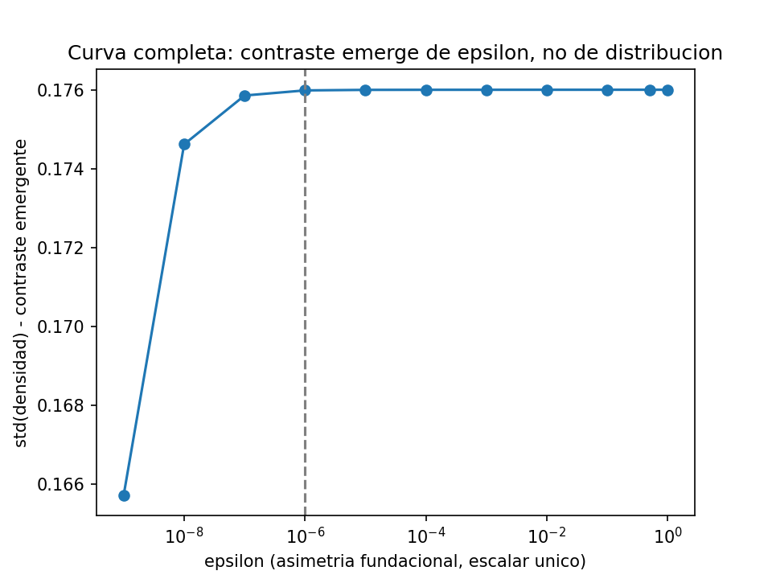

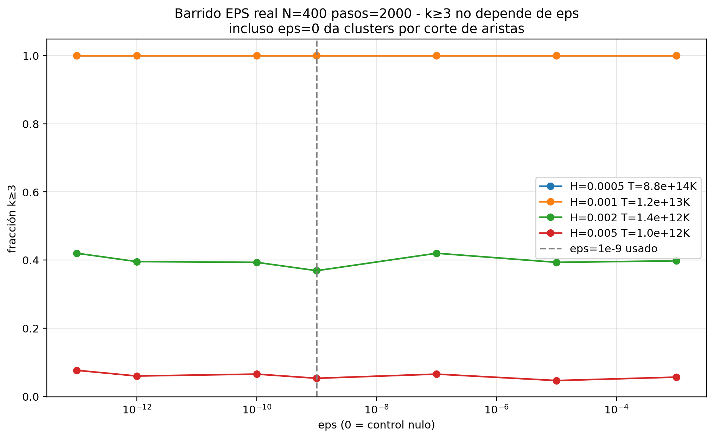

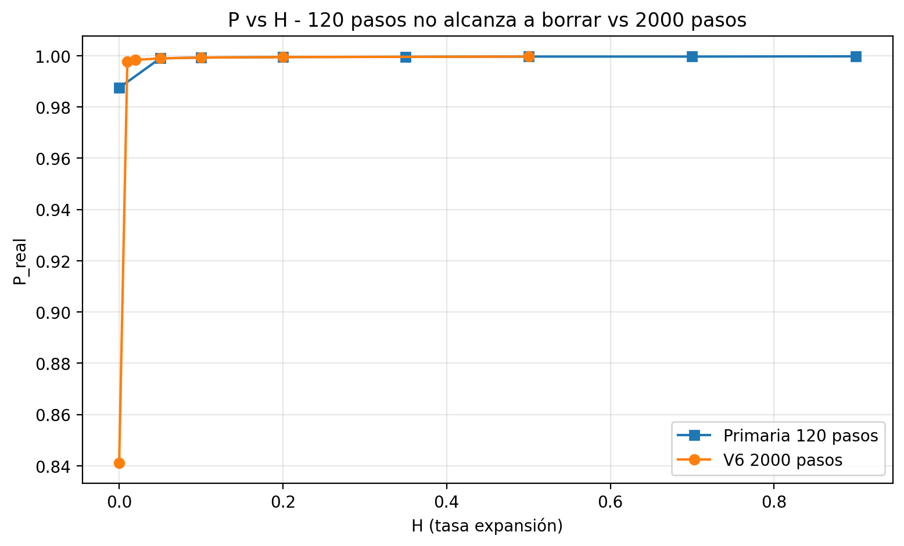

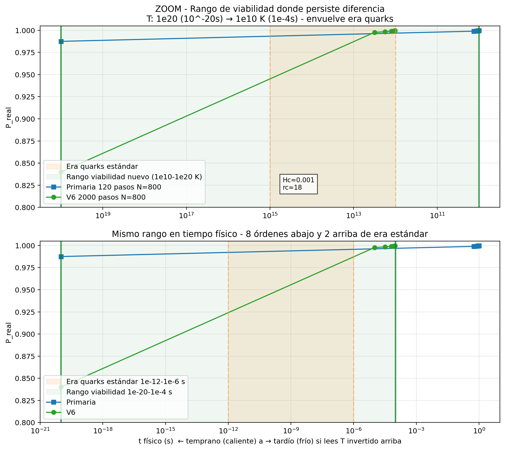

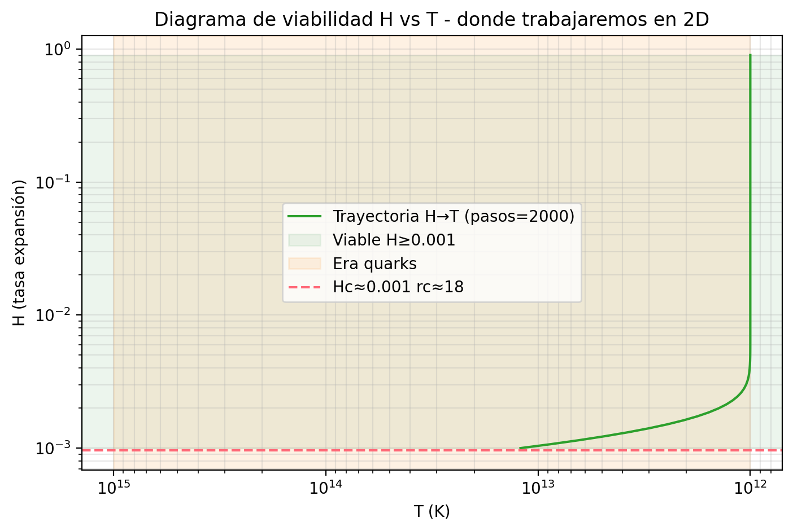

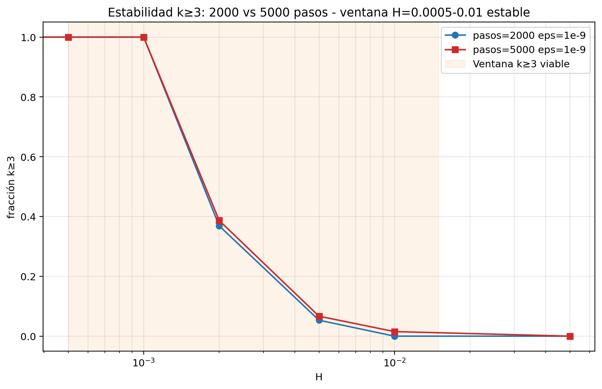

**CSV asociado:** `images/descarga-CSV-del-barrido-completo.csv`  
(`epsilon, n_distintos, std_contraste, max_dens` — p.ej. ε=0 → contraste 0; ε=1e-9 → std≈0.166)

---

## 2. Clusters k, null, z, 1D/2D

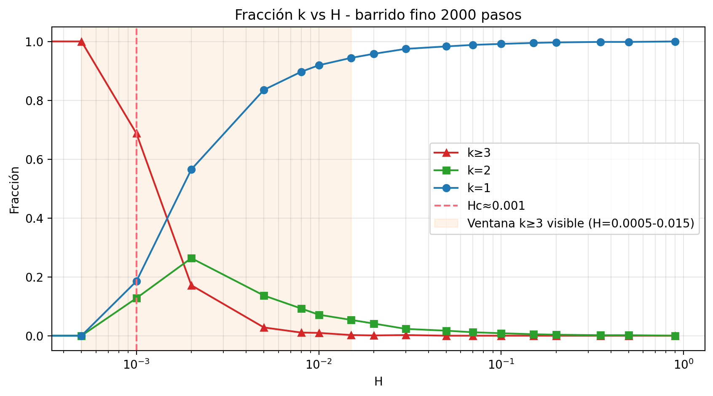

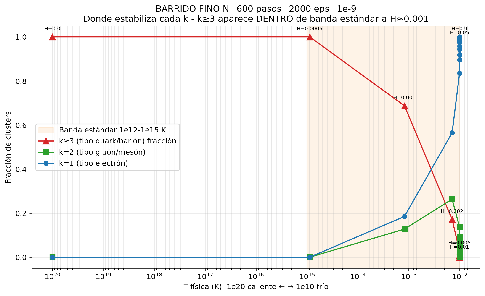

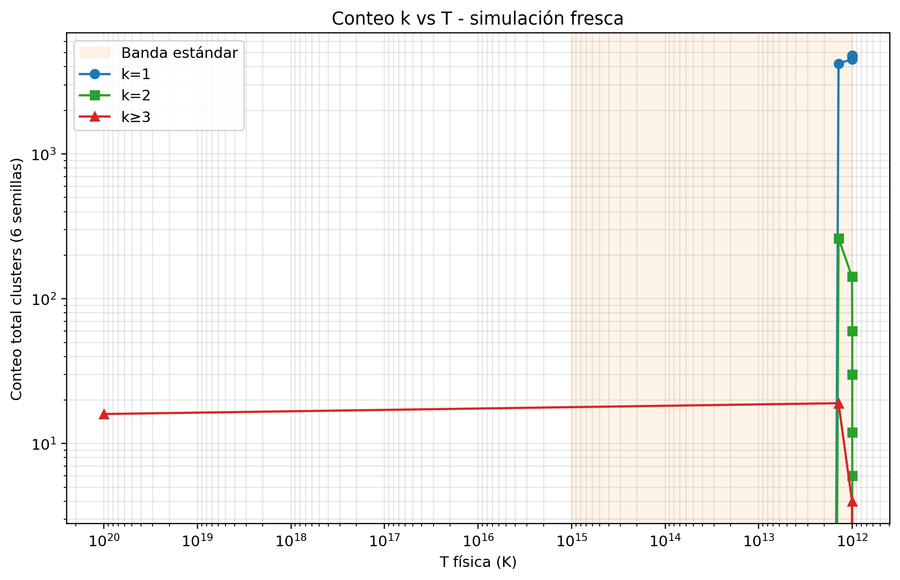

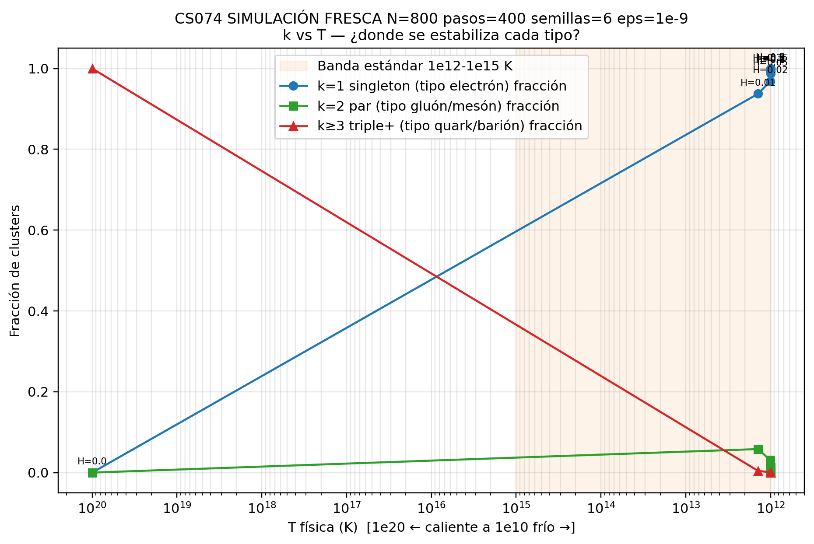

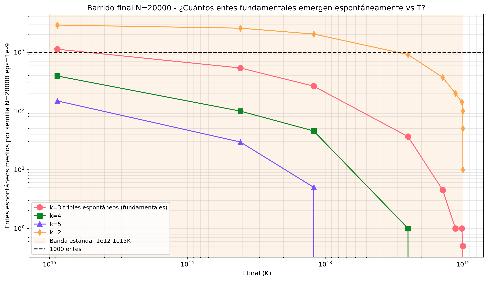

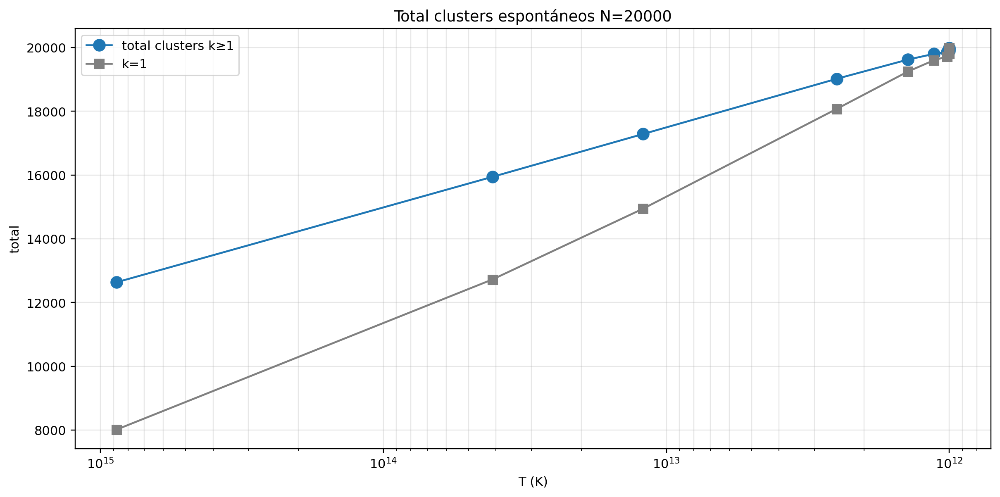

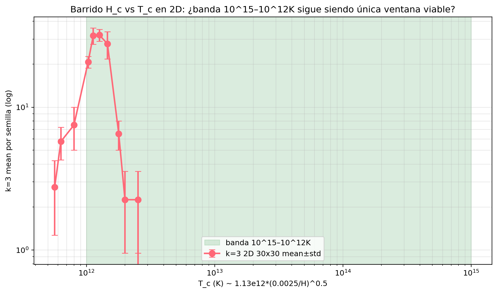

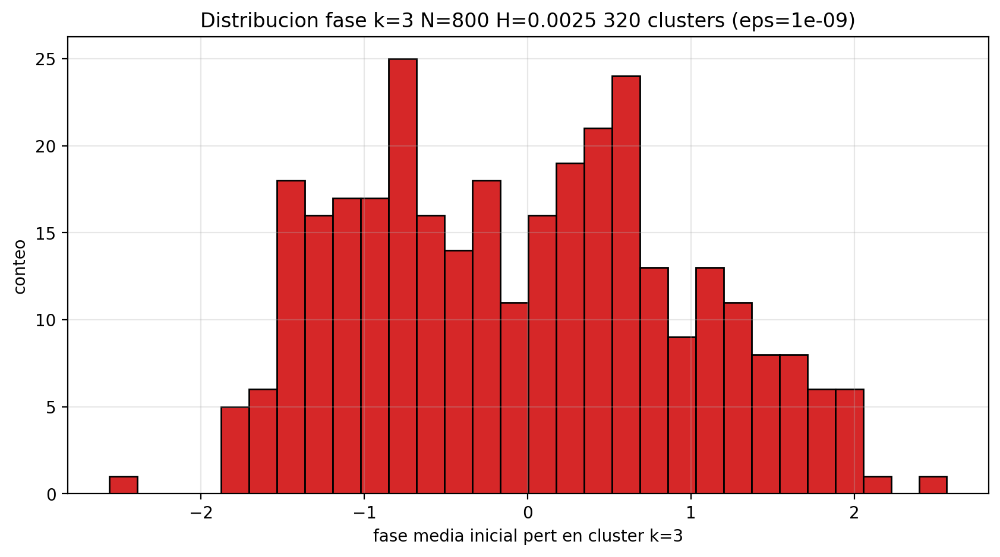

---

## 3. Siembra, capacidad, emergencia

---

## 4. r_crit / N = 20000

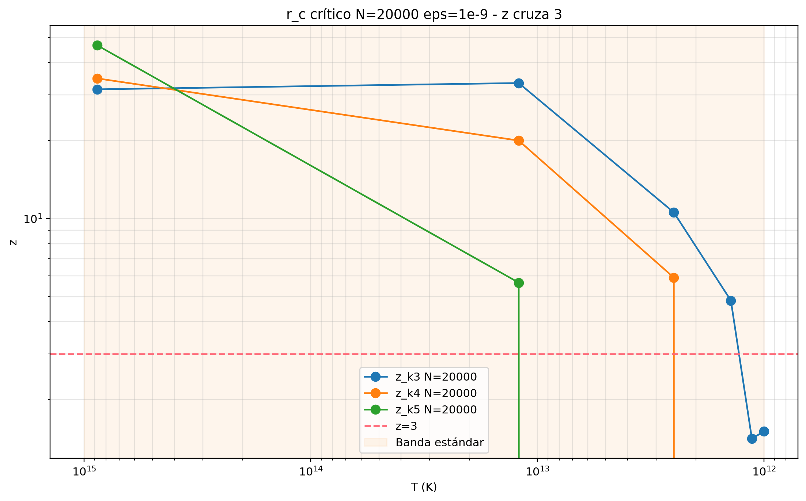

---

## 5. Fase 2 — repulsión, tensión, lógos, Z₃

---

## 6. Fase 3 — f(H), J_c, K_c, λ/α

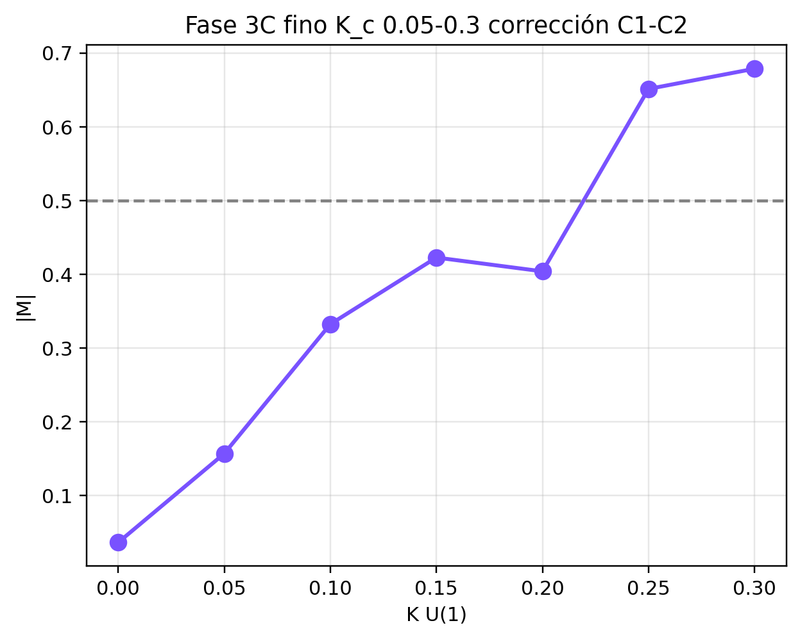

---

## 7. Masas / jerarquía (Fase 4 y tanda)

---

## 8. Datos crudos (no imagen)

| Tipo | Dónde |
|------|--------|
| JSON de barridos | `images/cs074_*.json`, `Límites.json`, `JSON-fino.json` |
| CSV ε | `images/descarga-CSV-del-barrido-completo.csv` |
| Scripts Meta | `images/Búsqueda-de-novedad-unificada*.py` |
| Producción Mac | `data/cs074_produccion_resultado_crudo.json` |
