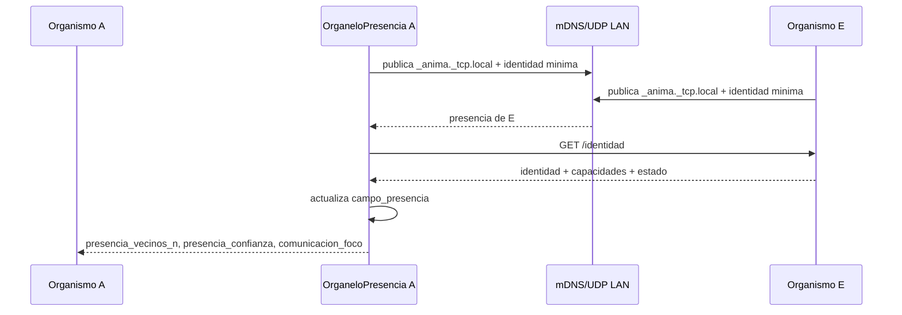
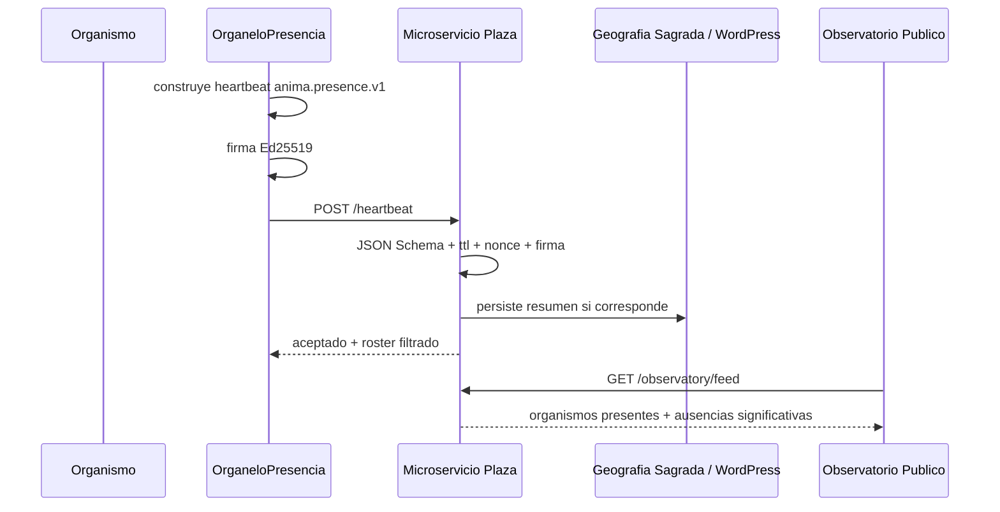

# Especificacion Tecnica Canonica
# Plaza, Organelo de Presencia, Observatorio Dinamico y Audio Local

Fecha: 2026-07-07  
Proyecto: VSTCosmo / ANIMA / Celula Madre  
Estado: especificacion canonica aprobada para implementacion, con ajustes Nivel 1 incorporados tras revision final del equipo

## 1. Decision Central

El descubrimiento de organismos se implementara como un organelo, no como una utilidad de red.

Nombre operativo inicial:

```text
OrganeloPresencia
```

Nota conceptual:

```text
OrganeloPresencia evolucionara hacia Organelo de Existencia Social / Campo Social.
```

Este organelo expresa la identidad minima del organismo, anuncia su presencia, percibe otros organismos, distingue ausencia/retorno/novedad y entrega senales metabolicas. No decide por si solo a quien escuchar ni controla la comunicacion; alimenta el metabolismo y el organo de comunicacion.

## 2. Principios Rectores

1. Un organismo instalable nace preguntando:
   - quien soy;
   - que cuerpo tengo;
   - que mundo local percibo;
   - que otros organismos estan presentes en mi campo;
   - que relaciones estan permitidas segun mis reglas de intimidad.
2. La presencia es un organo sensorial, no una lista de IPs.
3. La Plaza es un registro vivo minimo y reemplazable, nunca un cerebro.
4. El Observatorio es percepcion externa, solo lectura.
5. Cada organismo construye su mundo sonoro desde su entrada local; silencio basal es un estado valido.
6. Debe existir separacion estricta entre capa biologica y capa tecnologica.
7. Todo heartbeat global debe ir firmado criptograficamente desde el primer protocolo.
8. La Plaza debe saber lo minimo posible: identidad publica, ultimo pulso, estado publico, capacidades publicas, firma.
9. El backend de Plaza debe ser reemplazable: WordPress puede servir como sede publica/persistencia, pero no como dependencia irreemplazable ni canal de tiempo real intensivo.

## 3. Separacion de Capas

Glosario operativo:

```text
CAPA_BIOLOGICA_vs_CAPA_TECNOLOGICA.md
```

### 3.1 Capa Biologica

Conceptos que pertenecen al organismo:

- OrganeloPresencia;
- Audicion;
- Comunicacion;
- Campo Social;
- estado vital;
- hambre social;
- aislamiento;
- confianza;
- vinculo;
- retorno;
- novedad;
- silencio basal;
- presencia local/global;
- memoria episodica de relaciones.

### 3.2 Capa Tecnologica

Mecanismos intercambiables:

- mDNS / Zeroconf;
- UDP broadcast fallback;
- HTTP;
- WebSocket / SSE;
- WordPress REST API;
- FastAPI / Node relay;
- Ed25519;
- JSON Schema;
- sounddevice / PortAudio;
- ALSA / PulseAudio / PipeWire / CoreAudio / WASAPI;
- Rode / BlackHole / USB audio / microfonos locales.

Regla:

```text
La capa biologica no debe depender semanticamente de una tecnologia concreta.
```

Ejemplo:

- correcto: `entrada_local`, `servidor_remoto`, `otros_organismos`;
- incorrecto como concepto biologico base: `Rode`, `host.docker.internal`, `WordPress`.

## 4. Contrato `anima.presence.v1`

Archivo versionado:

```text
schemas/anima.presence.v1.json
```

### 4.1 Reglas Generales

- Todo mensaje global debe incluir `schema`, `protocol_version`, `organism_id`, `installation_id`, `public_key`, `nonce`, `ts`, `ttl_s` y `signature`.
- La firma cubre el payload canonico sin el campo `signature`.
- Algoritmo recomendado: Ed25519.
- `installation_id` persiste en el equipo instalador y evita colisiones entre organismos con nombres similares.
- `nonce` evita replay simple.
- `ttl_s` define vigencia del pulso. Para presencia global, el minimo operativo es 15 segundos.
- La Plaza rechaza heartbeats vencidos, duplicados sospechosos o mal firmados.
- Si `visibility=local`, el organismo no envia heartbeat global a la Plaza. Solo puede anunciarse por presencia local.

### 4.2 Estados Vitales

Estados iniciales:

```text
latente       = existe, no metaboliza activamente o esta recien instalado
dormido       = proceso vivo, actividad reducida voluntaria
atento        = despierto, percibe, aun sin conversacion
activo        = metaboliza y responde al mundo
conversando   = acoplado a otro(s) organismos
explorando    = busca mundo/relaciones/fuentes
silencioso    = vivo pero sin emitir voz o sin senal publica reciente
ausente       = ttl vencido; no es heartbeat valido actual
```

### 4.3 JSON Schema

```json
{
  "$schema": "https://json-schema.org/draft/2020-12/schema",
  "$id": "https://geografiasagrada.cl/schemas/anima.presence.v1.json",
  "title": "ANIMA Presence Heartbeat v1",
  "type": "object",
  "additionalProperties": false,
  "required": [
    "schema",
    "protocol_version",
    "organism_id",
    "installation_id",
    "name",
    "state",
    "visibility",
    "ts",
    "ttl_s",
    "nonce",
    "public_key",
    "signature",
    "capabilities"
  ],
  "properties": {
    "schema": {
      "const": "anima.presence.v1"
    },
    "protocol_version": {
      "type": "string",
      "pattern": "^1\\.0\\.\\d+$"
    },
    "organism_id": {
      "type": "string",
      "minLength": 3,
      "maxLength": 96,
      "pattern": "^[A-Za-z0-9_.:-]+$"
    },
    "installation_id": {
      "type": "string",
      "minLength": 16,
      "maxLength": 128
    },
    "name": {
      "type": "string",
      "minLength": 1,
      "maxLength": 120
    },
    "species": {
      "type": "string",
      "default": "ANIMA"
    },
    "version": {
      "type": "string",
      "maxLength": 64
    },
    "state": {
      "type": "string",
      "enum": ["latente", "dormido", "atento", "activo", "conversando", "explorando", "silencioso"]
    },
    "visibility": {
      "type": "string",
      "enum": ["privado", "local", "plaza_latente", "plaza_publico", "experimento"]
    },
    "ts": {
      "type": "string",
      "format": "date-time"
    },
    "ttl_s": {
      "type": "integer",
      "minimum": 15,
      "maximum": 3600
    },
    "nonce": {
      "type": "string",
      "minLength": 16,
      "maxLength": 128
    },
    "public_key": {
      "type": "object",
      "additionalProperties": false,
      "required": ["alg", "kid", "value"],
      "properties": {
        "alg": { "const": "Ed25519" },
        "kid": { "type": "string", "minLength": 8, "maxLength": 128 },
        "value": { "type": "string", "contentEncoding": "base64" }
      }
    },
    "signature": {
      "type": "object",
      "additionalProperties": false,
      "required": ["alg", "value"],
      "properties": {
        "alg": { "const": "Ed25519" },
        "value": { "type": "string", "contentEncoding": "base64" }
      }
    },
    "capabilities": {
      "type": "array",
      "items": {
        "type": "string",
        "enum": [
          "audio_local",
          "audio_server",
          "voz",
          "comunicacion",
          "gps",
          "cloroplasto",
          "wifi",
          "radio_digital",
          "sdr",
          "camara",
          "ptz",
          "pantalla_cabeza"
        ]
      },
      "uniqueItems": true
    },
    "public_endpoints": {
      "type": "object",
      "additionalProperties": false,
      "properties": {
        "identity": { "type": "string" },
        "state_summary": { "type": "string" },
        "voice_summary": { "type": "string" },
        "relay": { "type": "string" }
      }
    },
    "local_endpoints": {
      "type": "object",
      "additionalProperties": false,
      "properties": {
        "base_url": { "type": "string" },
        "identity": { "type": "string" },
        "state": { "type": "string" },
        "voice": { "type": "string" },
        "head": { "type": "string" }
      }
    },
    "location": {
      "type": "object",
      "additionalProperties": false,
      "properties": {
        "mode": { "type": "string", "enum": ["off", "aproximada", "exacta"] },
        "country": { "type": "string", "maxLength": 2 },
        "region": { "type": "string", "maxLength": 120 },
        "lat": { "type": "number", "minimum": -90, "maximum": 90 },
        "lon": { "type": "number", "minimum": -180, "maximum": 180 },
        "accuracy_m": { "type": "number", "minimum": 0 }
      }
    },
    "signals": {
      "type": "object",
      "additionalProperties": false,
      "properties": {
        "arousal": { "type": "number", "minimum": 0, "maximum": 1 },
        "valence": { "type": "number", "minimum": -1, "maximum": 1 },
        "energy": { "type": "number", "minimum": 0 },
        "voice_active": { "type": "boolean" }
      }
    }
  }
}
```

### 4.4 Canonicalizacion y Firma

Regla propuesta:

1. construir payload;
2. remover `signature`;
3. serializar JSON canonico: claves ordenadas, sin espacios superfluos, UTF-8;
4. firmar bytes con Ed25519;
5. insertar `signature.value` en base64.

Validacion:

1. validar JSON Schema;
2. validar `ts` dentro de tolerancia;
3. validar `ttl_s`;
4. verificar `nonce` no reutilizado recientemente para el mismo `installation_id`;
5. verificar firma con `public_key`;
6. aceptar o rechazar.

### 4.5 Identidad Persistente

Cada instalacion debe crear y conservar una identidad local en primera ejecucion.

Ruta recomendada:

```text
~/.anima/identity.json
```

Contenido minimo:

```json
{
  "schema": "anima.identity.v1",
  "installation_id": "uuid-or-random-128-bit",
  "organism_id": "ANIMA_E_PI",
  "name": "Nido de Condores",
  "created_at": "2026-07-07T13:00:00-04:00",
  "public_key": {
    "alg": "Ed25519",
    "kid": "base64url...",
    "value": "base64..."
  },
  "private_key_ref": "local-file-or-keyring"
}
```

Reglas:

- la clave privada no debe guardarse en documentos, logs ni Plaza;
- en Linux/Pi se puede iniciar con archivo local protegido (`0600`) y migrar luego a keyring;
- en macOS se debe preferir Keychain si se empaqueta como app;
- en Windows se debe preferir Credential Manager / DPAPI;
- si se regenera identidad, cambia `installation_id` salvo proceso explicito de migracion.

### 4.6 Bootstrap de Confianza

El primer encuentro no puede asumir confianza plena.

Modos iniciales:

```text
local_mdns         = confianza provisional por presencia local + GET /identidad
global_plaza      = confianza condicionada a firma valida + politica de Plaza
manual_pairing    = confianza elevada por confirmacion del usuario/experimento
known_key         = confianza alta por clave ya conocida
```

Regla v1:

- presencia local mDNS/UDP sin firma valida no autoriza relacion remota;
- presencia local con firma valida, pero clave nueva, entra como `confianza=0.7`;
- una clave conocida y valida entra como `confianza=1.0`;
- una firma invalida entra como `confianza=0.0` y emite evento `firma_rechazada`;
- para modo `experimento`, la relacion requiere clave valida y acuerdo explicito o lista de confianza.

Challenge-response local recomendado:

1. A descubre B por mDNS;
2. A pide `GET /identidad`;
3. A envia nonce a B en `POST /presencia/challenge`;
4. B firma el nonce con su clave privada;
5. A verifica con `public_key`;
6. A registra confianza provisional o conocida.

### 4.7 Rotacion y Revocacion de Claves

Antes de Fase 5 publica deben definirse endpoints de rotacion/revocacion.

Propuesta:

```text
POST /api/anima/v1/keys/rotate
POST /api/anima/v1/keys/revoke
GET  /api/anima/v1/keys/revocations
```

Reglas:

- rotacion debe firmarse con clave anterior y nueva cuando sea posible;
- revocacion debe quedar persistida en Plaza;
- un `kid` revocado no puede aceptar heartbeats globales;
- si una Pi pierde su clave, debe reingresar como nueva identidad o por recuperacion manual.

### 4.8 Rate Limit y Anti-Replay

Regla inicial de Plaza:

```text
ttl_s >= 15
max 1 heartbeat por installation_id cada ttl_s/2
nonce no reutilizable dentro de ventana de 10 minutos
```

Si llegan multiples heartbeats validos para el mismo `installation_id`, prevalece el de `ts` mas reciente, salvo que viole rate limit o nonce.

## 5. Descubrimiento Local

### 5.1 Metodo Primario: mDNS / Zeroconf

Servicio:

```text
_anima._tcp.local
```

TXT records sugeridos:

```text
schema=anima.presence.v1
organism_id=ANIMA_E_PI
installation_id=...
name=Nido de Condores
state=activo
visibility=local
capabilities=audio_local,gps,cloroplasto,radio_digital
identity_path=/identidad
presence_path=/presencia
```

### 5.2 Fallback: UDP Broadcast

Puerto propuesto:

```text
47788/udp
```

Limitaciones documentadas:

- UDP puede perder paquetes;
- no atraviesa VLANs ni routers;
- puede estar bloqueado por firewall;
- no debe usarse como prueba unica de ausencia;
- debe existir TTL y degradacion progresiva de estado.

### 5.3 TTL Local

Estados derivados por tiempo:

```text
0..ttl_s              = presente
ttl_s..3*ttl_s        = silencioso / ausente reciente
>3*ttl_s              = ausente
```

## 6. OrganeloPresencia -> Metabolismo

### 6.1 Salidas Minimas

```text
presencia_vivo
presencia_vecinos_n
presencia_local_n
presencia_global_n
presencia_confiable_n
presencia_confianza
presencia_aislamiento
presencia_retorno
presencia_novedad
presencia_densidad
presencia_proximidad
hambre_social
comunicacion_foco
```

### 6.2 Campo de Presencia

No modelar solamente un roster/lista. El organelo mantiene un campo:

```text
campo_presencia = {
  densidad,
  proximidad,
  persistencia,
  confianza,
  novedad,
  aislamiento
}
```

Cada vecino aporta intensidad segun:

```text
intensidad = confianza * frescura * visibilidad * afinidad
```

Donde:

```text
frescura = max(0, 1 - edad_heartbeat / ttl_s)
```

En v1, si no existe historia relacional, `afinidad=1.0`. En fases posteriores podra derivarse de memoria episodica, historia de vinculos, compatibilidad experimental o reglas del usuario.

### 6.3 Curvas Iniciales

Aislamiento:

```text
ANIMA_AISLAMIENTO_TIEMPO_SATURACION=300

si presencia_vecinos_n == 0:
  presencia_aislamiento = min(1.0, segundos_sin_vecinos / ANIMA_AISLAMIENTO_TIEMPO_SATURACION)
else:
  presencia_aislamiento = max(0.0, presencia_aislamiento - dt / 60.0)
```

El valor por defecto de 300 segundos es configurable. Para Pi solitaria o instalaciones educativas puede aumentarse para evitar que el organismo interprete el aislamiento como saturacion social demasiado rapido.

Hambre social:

```text
hambre_social = clamp01(0.65 * presencia_aislamiento + 0.35 * necesidad_relacional)
```

Novedad:

```text
presencia_novedad = 1.0 durante 10s si aparece installation_id no visto antes
```

Retorno:

```text
presencia_retorno = 1.0 durante 10s si reaparece un organismo conocido tras ausencia
```

Confianza:

```text
presencia_confianza =
  1.0 si firma valida y organismo conocido
  0.7 si firma valida y organismo nuevo
  0.2 si solo presencia local no firmada
  0.0 si firma invalida o heartbeat rechazado
```

Foco comunicativo:

```text
comunicacion_foco = organismo con mayor intensidad de campo
```

Esta salida no obliga a comunicarse; solo propone un foco metabolico.

## 7. Eventos

Ademas de heartbeat, el organelo debe emitir eventos discretos.

Eventos iniciales:

```text
nacio
desperto
durmio
descubrio_organismo
organismo_retorno
organismo_ausente
formo_vinculo
rompio_vinculo
cambio_estado_vital
cambio_visibilidad
firma_rechazada
plaza_conectada
plaza_desconectada
```

Evento tipo:

```json
{
  "schema": "anima.event.v1",
  "event_id": "uuid",
  "organism_id": "ANIMA_E_PI",
  "installation_id": "...",
  "type": "descubrio_organismo",
  "subject_id": "ANIMA_F_PI",
  "ts": "2026-07-07T12:45:00-04:00",
  "visibility": "plaza_publico",
  "payload": {
    "confidence": 0.7,
    "source": "mdns"
  },
  "signature": {
    "alg": "Ed25519",
    "value": "base64..."
  }
}
```

## 8. Plaza

### 8.1 Backend Reemplazable

La Plaza no debe acoplarse semanticamente a WordPress. Diseno recomendado:

```text
Organismos -> Microservicio Plaza -> WordPress / DB / cache / Observatorio
```

Implementacion inicial recomendada:

- microservicio FastAPI o Node;
- Redis o cache en memoria para presencia viva;
- WordPress para pagina publica, autenticacion limitada y persistencia basica;
- endpoint publico de roster consumido por Observatorio.

WordPress puede ser sede simbolica y publica en Geografia Sagrada, pero no debe procesar heartbeats de alta frecuencia si el numero de organismos crece.

### 8.2 Endpoints Plaza

```text
POST /api/anima/v1/heartbeat
GET  /api/anima/v1/organisms
GET  /api/anima/v1/organisms/{organism_id}
POST /api/anima/v1/events
GET  /api/anima/v1/observatory/feed
GET  /api/anima/v1/schema/anima.presence.v1.json
```

Si se expone via WordPress como implementacion inicial:

```text
/wp-json/anima/v1/...
```

Pero el contrato real y portable es `/api/anima/v1/...`; WordPress es sede publica/persistencia, no definicion del protocolo.

### 8.3 Reglas de Plaza

- rechazar heartbeats sin firma global;
- rechazar heartbeats con firma invalida;
- aplicar TTL;
- marcar ausente sin borrar inmediatamente;
- no exponer endpoints privados;
- no mezclar control remoto con observacion;
- registrar intentos invalidos como eventos de seguridad;
- permitir multiples Observatorios leyendo el mismo feed.

## 9. Observatorio Dinamico

El Observatorio lee la Plaza o el roster local y renderiza organismos presentes.

Requisitos:

- no asumir cinco organismos;
- aceptar cero o muchos organismos;
- mostrar ausencias significativas;
- mostrar ultimo pulso;
- mostrar estado vital;
- mostrar capacidades publicas;
- mostrar conversacion dinamica si hay datos;
- no permitir start/stop/configuracion;
- no llamar directamente a IPs privadas desde la pagina publica.

Transporte recomendado:

- local: SSE o WebSocket desde observatorio local;
- publico: SSE/WebSocket desde microservicio Plaza o polling moderado.

## 10. Audio Local Dinamico

### 10.1 Prioridad de Fuentes

Orden de descubrimiento para instalacion limpia:

1. `otros_organismos` desde OrganeloPresencia;
2. `entrada_local` detectada por sounddevice/PortAudio;
3. `servidor_remoto` opcional;
4. biblioteca experimental categorizada;
5. demos diagnosticos ocultos.

### 10.2 Variables

```text
ANIMA_AUDIO_MODE=auto|local|server|silent
ANIMA_AUDIO_LOCAL_POLICY=prefer-system-input|prefer-usb|manual
ANIMA_AUDIO_LOCAL_MATCH=
ANIMA_AUDIO_SERVER_OPTIONAL=1
ANIMA_AUDIO_LIBRARY_PROFILE=minimal|full|custom
VST_DISABLE_DIRECT_AUDIO=0
```

Ejemplos:

```text
ANIMA_AUDIO_MODE=local
ANIMA_AUDIO_LOCAL_POLICY=prefer-usb
ANIMA_AUDIO_LOCAL_MATCH=Rode
```

```text
ANIMA_AUDIO_MODE=server
VST_SERVIDOR_HOST=host.docker.internal
VST_SERVIDOR_PORT=8770
```

### 10.3 Silencio Basal

Silencio basal no es error. Es estado legitimo:

```text
entrada_local no disponible -> silencio basal + evento audio_silencio_basal
```

No debe reemplazarse automaticamente por `demo:tono`.

## 11. Biblioteca `audio_binaural`

La biblioteca completa no debe ir en el paquete base.

Perfiles:

```text
minimal = audios pequenos esenciales
full    = biblioteca completa externa/opcional
custom  = seleccion del usuario
```

Se requiere manifiesto:

```json
{
  "schema": "anima.audio_library.v1",
  "items": [
    {
      "id": "voz_estudio",
      "file": "Voz_Estudio.wav",
      "category": "voces",
      "size_bytes": 7123456,
      "duration_s": 74.2,
      "channels": 2,
      "tags": ["voz", "estudio"],
      "package": "minimal"
    }
  ]
}
```

La UI debe usar categorias y busqueda; no una lista desplegable plana.

## 12. Pruebas de Intimidad y Seguridad

Fase 4.5 obligatoria antes de Plaza publica.

Pruebas:

- modo `privado` no emite heartbeat global;
- modo `privado` no emite UDP si `ANIMA_PRESENCE_MODE=off`;
- heartbeats sin firma son rechazados;
- heartbeats con firma invalida son rechazados;
- nonce repetido es rechazado;
- organismo con visibilidad `plaza_latente` no publica datos sensibles;
- ubicacion exacta no se publica salvo consentimiento explicito;
- Observatorio no muestra IP privada;
- Plaza no permite start/stop/config remoto;
- ID duplicado queda marcado y logueado.

## 13. Diagramas de Secuencia

### 13.1 Descubrimiento Local



### 13.2 Heartbeat Global Firmado



## 14. Roadmap Refinado

### Fase 1: Contrato y Glosario

- JSON Schema `anima.presence.v1`;
- contrato de firma;
- glosario biologico/tecnologico;
- bootstrap de confianza local/global;
- persistencia de identidad `~/.anima/identity.json`;
- rate limit y anti-replay;
- matriz de estados vitales;
- matriz de eventos.

### Fase 2: OrganeloPresencia Local

- `organelos/VST_OrganoPresencia.py`;
- endpoint `/identidad`;
- endpoint `/presencia`;
- mDNS primario;
- UDP fallback;
- campo de presencia local;
- salidas metabolicas basicas.

### Fase 2.5: Metabolismo de Presencia

- curvas de aislamiento;
- hambre social;
- foco comunicativo;
- retorno/novedad;
- pruebas unitarias de modulacion.

### Fase 3: Observatorio Local Reactivo

- roster dinamico;
- sin supuesto de cinco organismos;
- ausencias significativas;
- SSE/WebSocket local.

### Fase 4: Audio Local Dinamico

- sounddevice/PortAudio;
- seleccion automatica de entrada local;
- silencio basal valido;
- UI de fuentes por categorias.

### Fase 4.5: Intimidad y Seguridad

- pruebas de visibilidad;
- rechazo de heartbeats falsos;
- no filtracion de IP privada;
- no exposicion de control remoto.

### Fase 5: Plaza Geografia Sagrada

- microservicio;
- integracion WordPress como sede publica;
- Observatorio publico read-only;
- feed dinamico.

### Fase 6: Comunicacion Remota

- WebSocket para voz simbolica/estado;
- WebRTC para audio/video si es necesario;
- Plaza solo redirige, no streamea intensivamente.

## 15. Entregables Inmediatos

1. Extraer JSON Schema a archivo versionado.
2. Crear glosario `CAPA_BIOLOGICA_vs_CAPA_TECNOLOGICA.md`.
3. Crear especificacion de `OrganeloPresencia`.
4. Definir pruebas de seguridad Fase 4.5.
5. Revisar Observatorio `9100` para eliminar lista fija de organismos.
6. Definir bootstrap de confianza y persistencia de identidad.
7. Hacer configurable `ANIMA_AISLAMIENTO_TIEMPO_SATURACION`.

## 16. Criterio de Aceptacion Inicial

El cambio se considera correctamente orientado cuando:

- una Pi limpia puede instalar un organismo sin depender del Rode del Mac;
- un organismo puede anunciarse localmente y descubrir a otro sin configuracion manual;
- el Observatorio muestra N organismos, no cinco fijos;
- un heartbeat global sin firma no entra a la Plaza;
- el modo privado no publica nada fuera del equipo;
- silencio basal no se considera fallo.
