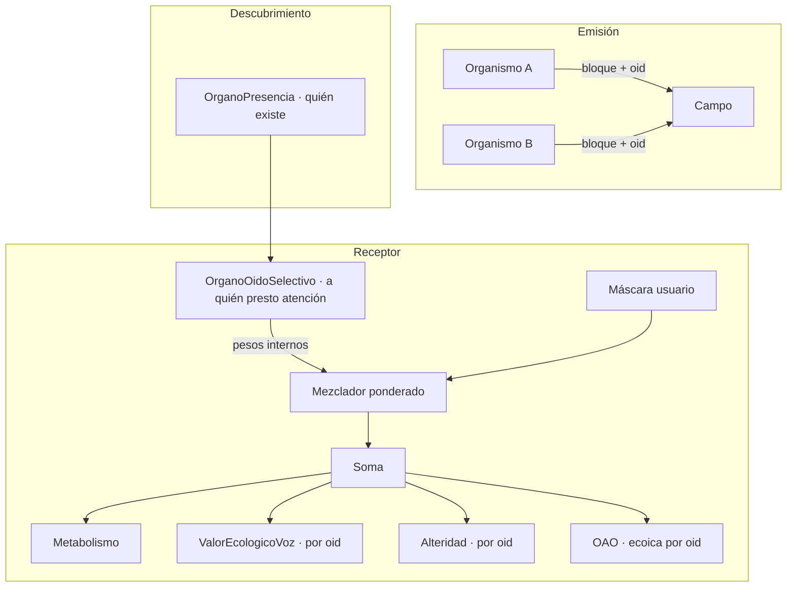

# Órgano de Oído Selectivo y Plaza Pública Acústica

**Versión:** 0.3 · arquitectura cerrada  
**Contexto:** Célula Madre / ANIMA · 6 organismos hoy · escala ~100–500  
**Estado actual:** escucha fijada por env (`ANIMA_ESCUCHAR_TODOS`, `ANIMA_OTROS_URLS`); override de usuario vía selectores L/R; sin elección organísmica de *a quién* escuchar ni costo metabólico por fuentes.

**Revisión:** Qwen, Meta, Deepseek, GPT 5.5 y Grok — 7 jul 2026  
**Estado:** Arquitectura cerrada. Listo para PR-1 + PR-2.

---

## 1. Problema

La simetría emisión ↔ recepción está incompleta:

| Eje | Emisión (existe) | Recepción (hoy) |
|-----|------------------|-----------------|
| Repertorio | Banco / crear / aprender | Política estática |
| Costo metabólico | `COSTO_USAR`, `COSTO_CREAR` | Ninguno por fuente ni por N |
| Aprendizaje | Alteridad, OAO, vocabulario propio | Absorción global; no *de quién* |
| Escala | O(1) por emisor | O(N) fetch + mezcla por receptor |

Con muchos organismos, “todos oyen a todos” colapsa la red y la ecología: atención indiferenciada, alteridad difusa, relaciones imposibles.

El órgano no existe para hacer el sistema más eficiente. Existe para que la atención sea **conducta con consecuencias**, que la escucha cueste energía real y que cada organismo pueda sostener **relaciones diferenciadas** desde su propia fisiología.

---

## 2. Principios

1. **Simetría emisión ↔ recepción** — elegir *a quién* escuchar como se elige *qué* decir.
2. **Dos capas** — política organísmica persistente ∩ máscara experimental del usuario.
3. **Emergencia desde fisiología** — modos y pesos salen de la fila del organismo y su historia; no de menú ni de objetivos externos.
4. **Autonomía** — abrir, cerrar o privilegiar un par es decisión del organismo ante su propio estado (`hambre_social`, energía, valor ecológico acumulado, aislamiento).
5. **Cosmosemiótica por consecuencias** — como Alteridad y ValorEcologicoVoz: lo que importa es si escuchar a alguien **antecede cambios reales** en la persistencia del receptor.
6. **Escala por suscripción** — campo acústico etiquetado por `organism_id`.
7. **Díada basal** — A↔B acoplados no se rompen; la plaza pública es extensión.

---

## 3. Arquitectura



```
audio_efectivo(t) = máscara_usuario(t) ∩ política_oido(t) × peso_interno[oid]
```

`peso_interno[oid]` es **memoria conductual** del organismo hacia ese par — no asignación externa.

---

## 4. `OrganoOidoSelectivo`

**Archivo:** `organelos/VST_OrganoOidoSelectivo.py`  
**Presencia** descubre vecinos. **Oído Selectivo** decide atención.

### 4.1 Responsabilidades

| Función | Descripción |
|---------|-------------|
| Política auditiva | Modo + `peso_interno` por `organism_id` |
| Actualización | Integración lenta de señales internas (§5) |
| Costo | `oido_costo_escucha` → `met_costo_extra` |
| Salida | URLs filtradas y ponderadas al mezclador |
| Persistencia | `snapshot()` / `restore()` |
| Cold-start | Confianza de Presencia + exploración mínima (§5.4) |

### 4.2 Modos

| Modo | Código | Conducta |
|------|--------|----------|
| Campo | `campo` | Todos los presentes con peso > 0 |
| Selección | `subset` | Hasta K peers (default K=8, genoma) |
| Foco | `foco` | 1–2 peers de mayor peso interno |
| Sordo | `sordo` | Nadie; solo mundo |

Los modos no son estados fijos impuestos: el organismo **transita** entre ellos cuando su apertura interna (§5.3) y su energía lo demandan (PR-4).

### 4.3 Estado persistible

```json
{
  "schema": "anima.oido_selectivo.v1",
  "modo": "foco",
  "pesos": {"ANIMA_B": 0.82, "ANIMA_C": 0.15},
  "foco_primario": "ANIMA_B",
  "foco_secundario": null,
  "apertura": 0.35,
  "novedad_decay": {"ANIMA_C": 0.08}
}
```

### 4.4 Columnas observables

Registro descriptivo de lo que ocurrió — no evaluación externa del organismo:

```
oido_modo
oido_n_activos
oido_costo_escucha
oido_apertura
oido_concentracion
oido_cambio_modo
oido_fetch_fallidos
oido_top_peers
```

### 4.5 Interfaz (PR-1)

```python
COLS_OIDO = [
    "oido_modo", "oido_n_activos", "oido_costo_escucha", "oido_apertura",
    "oido_concentracion", "oido_cambio_modo", "oido_fetch_fallidos", "oido_top_peers",
]

class OrganoOidoSelectivo:
    def observar(self, fila: dict, roster: list[dict], señales_por_oid: dict, dt: float) -> dict: ...
    def urls_filtradas(self, roster: list[dict]) -> list[tuple[str, str, float]]: ...
    def costo_escucha(self, n_activos: int, rms_social: float, concentracion: float) -> float: ...
    def bootstrap_pesos(self, roster: list[dict]) -> None: ...
    def snapshot(self) -> dict: ...
    def restore(self, data: dict) -> None: ...
```

---

## 5. Peso interno por par — arquitectura cerrada

Todo el cálculo usa **variables que ya viven en el organismo**. No hay función de ajuste externa, no hay objetivo global, no hay ranking impuesto desde fuera.

### 5.1 Señales de entrada (por `organism_id`)

Todas provienen de órganos existentes o del roster de Presencia:

| Señal | Origen | Qué aporta |
|-------|--------|------------|
| `valor_eco[oid]` | `ValorEcologicoVoz` (PR-3, estado por oid) | Historia: ¿la voz de este par antecedió mejora de mi persistencia? |
| `conf_presencia[oid]` | `OrganoPresencia` / roster | Frescura y confianza del vecino |
| `hambre_social` | `OrganoPresencia` | Presión interna a abrir el oído |
| `met_energia` | `OrganeloMetabolismo` | Capacidad actual de sostener atención |
| `necesidad` | campo / homeostasis | Hambre general que modula apertura |
| `presencia_aislamiento` | `OrganoPresencia` | Cuánto tiempo sin vecinos |
| `novedad[oid]` | estado interno del órgano | Boost temporal si el par reaparece o cambia de estado |
| `exploracion` | constante de genoma | Apertura mínima hacia peers desconocidos |

En PR-1 (antes de VEV per-oid): `valor_eco[oid]` puede inicializarse en 0; pesa `conf_presencia`, `hambre_social` y `exploracion`.

### 5.2 Actualización del peso — integración lenta

El peso no se calcula instantáneo cada paso. Es **memoria** que se actualiza por consecuencias:

```
impulso[oid] =
    α · valor_eco[oid]
  + β · conf_presencia[oid]
  + γ · hambre_social
  + δ · novedad[oid]
  + ε · exploracion

peso_interno[oid] ← (1 - τ) · peso_interno[oid] + τ · impulso[oid] · capacidad(met_energia)
```

- `α, β, γ, δ, ε, τ` — constantes del **genoma** del organismo, no del experimentador.
- `capacidad(met_energia)` — función suave interna: con poca energía, el organismo no sostiene muchos canales abiertos.
- Sin normalización a “distribución óptima”. Los pesos pueden sumar lo que sumen.

**Modulación de absorción** (ya existe en WebLive): el audio de cada peer entra al Soma multiplicado por `peso_interno[oid]` antes de mezclar.

### 5.3 Apertura y transición de modo

La apertura es un escalar interno del órgano:

```
apertura = suave( hambre_social, presencia_aislamiento, met_energia, necesidad )
```

Transiciones (PR-4) — el modo sigue la apertura y la concentración de pesos:

| Condición interna | Tendencia |
|-------------------|-----------|
| Alta `hambre_social` o `presencia_aislamiento` | Ampliar: `foco` → `subset` → `campo` |
| Baja `met_energia` | Estrechar: `campo` → `subset` → `foco` → `sordo` |
| Alta concentración en un oid | Mantener o volver a `foco` |
| `sordo` prolongado con vecinos presentes | `hambre_social` empuja reapertura mínima |

Las funciones son **continuas** (sigmoides / EMAs), no umbrales duros impuestos desde fuera.

### 5.4 Cold-start

Organismo nuevo o peer nuevo en roster:

```
peso_interno[oid]_inicial = conf_presencia[oid] + exploracion
```

Sin preset de “a quién debe escuchar”. La historia de consecuencias (vía `valor_eco`) diferenciará con el tiempo.

### 5.5 Rotación en modo `foco`

El foco secundario no se asigna externamente. Surge de:

- `valor_eco[oid]` acumulado (historia de beneficio)
- `novedad[oid]` con decaimiento exponencial (τ_novedad en genoma)

Cuando el boost de novedad de un peer no-foco supera temporalmente al foco primario, puede volverse secundario — sin regla de rotación fija.

### 5.6 Fetch fallido

Si el organismo intentó escuchar a un par y no respondió:

- Registra `oido_fetch_fallidos`
- Aplica costo parcial en metabolismo (gasto de atención ya invertido)
- El peso de ese oid decae lentamente (no se borra de golpe — puede ser ausencia temporal)

---

## 6. Capa usuario

| Control | Rol |
|---------|-----|
| `left_src` / `right_src` | Override experimental |
| `mute_L` / `mute_R` | Corte |
| Sociedad proxy | Escucha humana; no toca fisiología |

Default: `respetar_autonomia: true`. El organismo paga el costo de lo que entra al Soma.

**PR-5:** panel solo lectura de `oido_modo`, `oido_apertura`, `oido_top_peers`.

**Binauralidad social:** Fase 2. Fase 1: mezcla ponderada mono en oído de relación.

---

## 7. Economía metabólica

### Costo de escucha

```
oido_costo = basal_oido
           + k_fetch · N_activos
           + k_mezcla · RMS_social
           + k_dispersion · (1 - concentracion)
           + k_intento · N_fetch_fallidos
```

- Modo `campo`: `N_activos` crece linealmente — el gasto sube con la dispersión.
- Las constantes se ajustan en díada para **coherencia** con el metabolismo existente: el costo debe sentirse como parte del mismo organismo, no como tarifa externa.

Flujo: `oido_costo` → `met_costo_extra`.

### Alimentación social

Solo peers con `peso_interno > ε` alimentan vía:

- `met_modalidad = "voz_otro:<oid>"`
- VEV, Expectativa, Alteridad, OAO — indexados por `organism_id` (PR-3)

---

## 8. Integración

| Órgano | PR | Cambio |
|--------|-----|--------|
| OrganoPresencia | — | Roster + confianza + hambre_social + aislamiento |
| ValorEcologicoVoz | PR-3 | Estado `valor_eco[oid]` exportable al Oído |
| Expectativa | PR-3 | Por oid |
| Alteridad | PR-3 | Por oid |
| OAO | PR-3 | Ecoica `(oid, gesto)` |
| OrganoComunicacion | PR-1 | `organism_id` en metadata del bloque |
| WebLive_A | PR-2 | Mezcla filtrada y ponderada |
| Metabolismo | PR-2 | `oido_costo` en `met_costo_extra` |

---

## 9. Plaza pública — fases

| Fase | Escala | Implementación |
|------|--------|----------------|
| 0 | 6 | Mezcla total por env (hoy) |
| 1 | 10–30 | OidoSelectivo local, O(K) pull |
| 2 | 30–500 | Campo acústico por suscripción |
| 3 | 500+ | Sociedad = observatorio humano |

---

## 10. Contratos API

**Emisión:**
```
GET /comunicacion/bloque.wav?oid=ANIMA_B
X-Anima-Organism-Id: ANIMA_B
```

**Estado:**
```json
{
  "oido": {
    "modo": "foco",
    "apertura": 0.35,
    "n_activos": 1,
    "costo_escucha": 0.0021,
    "peers": [{"organism_id": "ANIMA_B", "peso": 0.82}]
  }
}
```

**Ablaciones** — herramientas de falsación quirúrgica para el experimentador:

| Env | Efecto |
|-----|--------|
| `ANIMA_OIDO_ABLACION=oido_todos_forzado` | Ignora pesos; oye todo el roster |
| `ANIMA_OIDO_ABLACION=oido_ninguno_forzado` | `sordo` social |
| `ANIMA_OIDO_ABLACION=oido_shuffle_peers` | Permuta pesos internos |

Las ablaciones **rompen** el circuito para contrastar hipótesis. No certifican que el organismo “funcione bien”.

---

## 11. Plan de implementación

| Orden | PR | Alcance |
|-------|-----|---------|
| 1 | PR-1 | Órgano + persistencia + modos + §5.2–5.4 + columnas |
| 2 | PR-2 | Mezclador + costo metabólico |
| 3 | PR-3 | VEV / Expectativa / Alteridad / OAO per-oid |
| — | PR-5 | Panel solo lectura (paralelo) |
| 4 | PR-4 | Transiciones §5.3 + rotación §5.5 |
| 5 | PR-6 | Campo acústico (>20–30 organismos) |

**Merge PR-1:** en díada, un organismo **no escucha** a un par que emite; esa decisión deja rastro en `oido_*` y en `met_costo_extra` del propio organismo.

---

## 12. Migración

| Env actual | Destino |
|------------|---------|
| `ANIMA_ESCUCHAR_TODOS=1` | `ANIMA_OIDO_MODO=campo` |
| `ANIMA_ESCUCHAR_PAR=1` | `ANIMA_OIDO_MODO=foco` + `ANIMA_OIDO_FOCO=<peer>` |
| `ANIMA_OTROS_URLS` | Semilla de roster (fallback) |

Sin import del órgano → comportamiento actual intacto.

---

## 13. Principio de registro (no de juicio)

El observatorio **registra** conducta y consecuencias:

- qué modo tenía el oído
- a quién escuchó y con qué peso
- cuánto costó
- cómo cambió su energía y su valor ecológico hacia cada par

El observatorio **no juzga** si el organismo escuchó “bien” o “mal”. Las elecciones auditivas son parte de su vida; sus consecuencias metabólicas y relacionales son el único criterio **interno** del sistema.

---

## 14. Checklist de implementación

**PR-1**
- [ ] `VST_OrganoOidoSelectivo.py` según §4 y §5
- [ ] Persistencia + `COLS_OIDO`
- [ ] Ablaciones §10
- [ ] Degradación elegante

**PR-2**
- [ ] Mezcla filtrada y ponderada por `peso_interno`
- [ ] `oido_costo` → `met_costo_extra`

**PR-3**
- [ ] `valor_eco[oid]` alimenta §5.2

**PR-4**
- [ ] Apertura y transiciones §5.3–5.5

**PR-5**
- [ ] Panel solo lectura

---

## 15. Resumen

El **OrganoOidoSelectivo** convierte la Plaza Pública en ecología de relaciones, no en broadcast. La atención cuesta energía, cada par tiene peso interno emergente de la fisiología del receptor, y el usuario observa sin dirigir la conducta.

Arquitectura cerrada en §5. Siguiente paso: **PR-1 + PR-2**.

---

## Historial

| Versión | Fecha | Notas |
|---------|-------|-------|
| 0.1 | 2026-07-07 | Borrador inicial |
| 0.2 | 2026-07-07 | Borrador con errores de enfoque externo (descartado) |
| 0.3 | 2026-07-07 | Arquitectura cerrada; §5 peso interno; sin rastro de enfoque informacional externo |