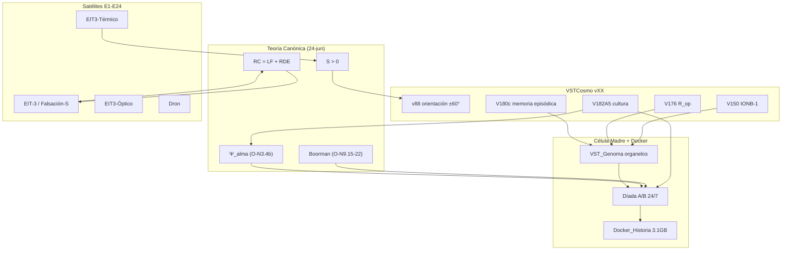

# INFORME CONSOLIDADO — Programa RMD / Cosmolab

**Para:** Equipo transinteligente RMD 2.0 (Club Abulafia)  
**Investigador Principal:** Alexis López Tapia  
**Compilación:** Grok (Diotallevi) · 28-jun-2026  
**Alcance:** Teoría canónica, programa VSTCosmo/ANIMA, Célula Madre/Docker, y experimentos satélite en `/Users/alexis/Desktop/RMD`

> Documento de síntesis para poner al equipo al día. Reúne lo revisado en la sesión del 28-jun-2026:
> informes markdown y PDF del repo VSTCosmo, Teoría Cosmosemiótica Canónica (24-jun-2026, 52 pp.),
> estado operativo Docker, y el inventario de proyectos en Cosmolab y RMD.

---

## 0. Resumen ejecutivo

El programa RMD avanza en **tres frentes convergentes**:

1. **Teoría** — La *Teoría Cosmosemiótica Canónica* (24-jun-2026) consolida el marco: axioma **S > 0**, ley **RC = LF + RDE**, ciclo **D→R→Acción→A**, genealogía de la Libertad Funcional (juego→ritual→¬R_op), y la función organizadora relacional **Ψ_alma** (O-N3.4b).

2. **VSTCosmo / ANIMA** — De v1 (abril) a V182 (junio), el linaje demostró orientación espacial, código Ω, IONB-1 (ANIMA-1), el primer «No» operativo (V176), memoria episódica (V180c), cultura acumulativa (V182A5) y convención emergente (V182C). La **verificación independiente** (22-jun) confirma **9/10 hitos** con matices documentados; V103 recategorizado correctamente.

3. **Célula Madre + Docker** — Arquitectura de organelos anclada nodo a nodo al canon, desplegada en **díada 24/7** (puertos 7788/7799), con biografía longitudinal (~3.1 GB en `Docker_Historia/`), membrana MCP (9000) y puente de audio Rødecaster (8766). El **locus de Boorman** (O-N22) está desarrollado y expresado desde 24-jun; la díada reconoce mutuamente **Ψ_alma ≈ 0.985** pero permanece en **atractor «mudo»** (equilibrio de Nash en silencio).

**Próximo nodo formal:** V182D (alteridad como gate interpretativo) → V183 (Ψ_alma mínima, irreductibilidad relacional).

**Experimentos satélite** (EIT-3, Falsación-S, Levitron, Dron, EIT3-Térmico/Óptico) sostienen la base probatoria conceptual E1–E24 y no compiten con la pista vXX ejecutable.

---

## 1. Marco teórico — Teoría Cosmosemiótica Canónica (24-jun-2026)

Fuente: `Teoria_Cosmosemiotica_Canónica_24-06-2026.pdf` (52 pp., texto extraído en `_docscan/Teoria_Canonica_24-06-2026_DESKTOP_pdf.txt`).

### 1.1 Axioma y ley central

| Concepto | Enunciado | Rol experimental |
|---|---|---|
| **S > 0** | Persistencia mínima no nula de una diferencia | Condición trascendental; sin S no hay organismo |
| **RC = LF + RDE** | Ruido Contextual = Libertad Funcional + disipación | Verificada en EIT-3 (error < 0.01, LF +544%) |
| **A_sys-env** | Acoplamiento sistema-entorno | Variable unificadora; caída a 0 = colapso |
| **Ciclo D→R→Acción→A** | Percepción → representación → acción → realimentación | v91 muestra que el lazo Acción→A **no cierra** en campo rico (hallazgo negativo duro) |

### 1.2 Genealogía de la Libertad Funcional

La LF no es un interruptor sino una **secuencia evolutiva**:

```
juego (desacople enactuado) → ritual (cristalización bajo presión histórica) → ¬R_op (negación operativa)
```

En VSTCosmo: V157–V165 (juego/ritual), V176 (primer «No» deliberativo), V180 (veto episódico).

### 1.3 Nodos clave para el programa actual

| Nodo | Contenido | Implementación en código |
|---|---|---|
| **O-N3.4** | Alteridad / agencia | `VST_Alteridad.py`, `VST_ValorEcologicoVoz.py`, `VST_Expectativa.py` |
| **O-N3.4b** | Ψ_alma (función organizadora relacional) | `VST_DiadaAltruismo.py`, gate para V183 |
| **O-N9.14** | OI (Índice de Organismicidad) | `VST_Genoma.py` — OI multicelular = 0.858 |
| **O-N9.15–18** | Genética del altruismo (Boorman) | `locus_altruismo_boorman()` — desarrollado 24-jun |
| **O-N22** | Bloque pluricelular voluntario | Gobernanza díada A↔B |
| **O-TΔ** | Tiempo como inercia de persistencias | Fatiga V150, ritual V165 |

### 1.4 Dos pistas probatorias (no confundir)

| Pista | Qué es | ¿Ejecutable como `.py`? |
|---|---|---|
| **E1–E24** | Experimentos conceptuales/aplicados: radio, Bluetooth EIT, Daisyworld, térmica, fiscalía, Cosmo-SETI | **No** — base teórica y aplicada |
| **vXX VSTCosmos** | Simulaciones de campo: organismo, orientación, memoria, comunicación | **Sí** — pista verificable (ADDENDUM) |

---

## 2. Programa VSTCosmo — Genealogía experimental (abril–junio 2026)

Fuente principal: `GENEALOGIA_EXPERIMENTAL_VSTCosmo.md` (267 scripts, ~13 informes).

### 2.1 Línea de tiempo

| Etapa | Versiones | Fecha | Hito |
|---|---|---|---|
| Fundación | v1–v53 | abr 2026 | Receptor → regulador (Φ, memoria triple, metabolismo) |
| Campo continuo | v55–v72c | abr 2026 | Falsación Shannon; modos propios (voz/ruido = 9.95) |
| Orientación + Ω | v80h–v116 | abr–may | Binaural ±60° (v88); 100 ciclos (v90); código Ω |
| **ANIMA-1** | V122–V150 | may–1 jun | Organismo mínimo (IONB-1); fatiga = tiempo (O-TΔ) |
| **ANIMA-2** | V153–V181 | jun | Cb, ritual (r=0.988), **primer «No»** (V176), memoria episódica (V180) |
| **ANIMA-4 / V182** | V182A–C | 6–19 jun | Cultura acumulativa, comunicación, convención Schelling |
| **Célula Madre** | arquitectura | 22–28 jun | Organelos + Docker díada 24/7 + Boorman O-N22 |
| **Próximo** | V182D → **V183** | — | Alteridad (gate) → Ψ_alma mínima |

### 2.2 El hilo narrativo

> *persistir (S>0) → regular → acoplarse como campo → tener identidad → ser organismo → recordar → decir «no» → reconocer al otro → avisarle un peligro → compartir un alma mínima.*

### 2.3 Hitos verificados (ADDENDUM 22-jun)

Re-ejecución real con stdout capturado (`verificacion_hitos/*.log`):

| Hito | Afirmación del informe | Veredicto real |
|---|---|---|
| V117 | R₂ sin lateralidad | ✅ coincide |
| V118 | Lateralidad sin R₂ | ✅ coincide |
| V122 | Coexistencia R₂ + lateralidad («primer EIT-3») | ✅ pilar-clímax |
| V132 | Organismo mínimo funcional | ✅ coincide |
| V147 | Baseline fisiológico sano | ✅ cifras idénticas |
| V150 | IONB-1, cierre ANIMA-1 | ✅ (residuo: recuperación post-reposo −6%) |
| V176 | R_op, primer «No» operativo (4/4) | ✅ coincide |
| V180c | Memoria episódica | ✅ conducta real; mecanismo de recall sobreafirmado |
| V182A5 | Comunicación bidireccional / cultura acumulativa | ✅ ON 89%/11.94 vs OFF 70%/6.47 |
| V103 | Clasificación multiestímulo | ✅ recategorizado: Ω como espacio representacional reproducible |

**Hallazgos negativos documentados (no ocultar):**

- **v72a** — criterio causal no pasó
- **v91** — lazo Acción→A no cierra (C30 = 1/100)
- **v84b** — inversión Δ(L,R) parcial en aislamiento; superado por v88

---

## 3. Célula Madre — Arquitectura y consolidación

Fuente: `INFORME_CELULA_MADRE_Cosmosemiotica.md`, `INFORME_AVANCE_TECNICO_26jun2026.md`.

### 3.1 Qué es (y qué no es)

- **Es:** reescritura del organismo monolítico (`VST_Celula_Madre_001.py`) como **genoma de organelos** pluripotente, modular y evolucionable, anclado nodo a nodo al canon.
- **No es:** un experimento con hipótesis falsable ni una optimización puntual.

### 3.2 Índice de Organismicidad (OI)

| Configuración | OI | Nivel |
|---|---|---|
| Célula mínima (solo motor) | ≈0.000 | no organismal |
| + Bloque 7 (LF) | ≈0.147 | no organismal (κ_LF ✓) |
| + Bloque 5 (consciencia, R₂) | ≈0.244 | no organismal |
| + Bloque 8 (exaptación) | ≈0.444 | protoorganismo |
| + Homeostasis | **0.648** | protoorganismo alto |
| **Multicelular (ME = S_shared)** | **0.858** | **ORGANISMO PLENO** |

El salto a multicelular es estructural: la memoria externalizada solo existe en el colectivo.

### 3.3 Seis principios fundadores

1. Pluripotencia (incluye díada como potencial dormido)
2. Modularidad-organelo (comunicación solo por `Milieu`)
3. Economía metabólica (sin «Pastor» encubierto)
4. Escalamiento alométrico Kleiber (extensión declarada, no nodo canon)
5. Loci reservados (Boorman → multicelularidad voluntaria)
6. Adaptación y exaptación (el genoma describe de dónde parte, no a dónde llega)

### 3.4 Catálogo de organelos (implementados y vivos)

| Subsistema | Archivo(s) | Nodo(s) |
|---|---|---|
| Genoma | `VST_Genoma.py` | O-N2.1, O-N3.4, **O-N22**, O-N9.x |
| Consciencia | `VST_Bloque05_ConscienciaFuncional.py` | O-N5, O-N13.8 |
| Libertad Funcional | `VST_Bloque07_LibertadFuncional.py` | O-N7, O-N10 |
| Dinámica evolutiva | `VST_Bloque08_DinamicaEvolutiva.py` | O-N8, O-N9.14 |
| Campo Φ | `VST_Celula_Madre_001.py`, `Célula_Madre_Funcional_001` | C-N2, C-N7 |
| RC biaural | `VST_RC_A/B.py` | O-N1 |
| Homeostasis | `VST_Homeostasis.py`, `VST_HomeostasisEmergente.py` | O-N6.1, O-N9.14 |
| Metabolismo | `VST_Metabolismo.py` | C-N2 |
| Memoria | `VST_Memoria.py` | sustrato cognitivo |
| Comunicación / voz | `VST_OrganoComunicacion.py` | soporta O-N3.4 |
| Alteridad | `VST_Alteridad.py` | **O-N3.4** |
| Valor ecológico voz | `VST_ValorEcologicoVoz.py` | genealogía O-N3.4 |
| Expectativa | `VST_Expectativa.py` | genealogía O-N3.4 |
| Díada altruismo | `VST_DiadaAltruismo.py` | **O-N22** |
| Persistencia | `vst_persistencia.py`, `vst_historia.py` | infraestructura |

**Entrada:** `venv/bin/python3 VST_CelulaMadre.py`

---

## 4. Docker — Díada ANIMA en producción (26–28 jun)

### 4.1 Arquitectura desplegada

| Contenedor | Puerto | Función |
|---|---|---|
| `anima-a` | 7788 | Organismo A — WebLive |
| `anima-b` | 7799 | Organismo B — WebLive |
| `anima-mcp` | 9000 | Membrana MCP (streamable-http) |
| `anima-conversacion` | 9100 | Observatorio conversación A↔B |

**Fuera de Docker:** `VST_AudioServer.py` :8766 → Rødecaster Pro (puente TCP vía `host.docker.internal`).

**Principio canónico:** *Docker = cuerpo/ambiente operativo, no cerebro; MCP = membrana, no inteligencia.*

### 4.2 Persistencia en tres capas

1. **Volúmenes Docker** (`anima_a_data`, `anima_b_data`) — memoria del organismo entre reinicios
2. **Biografía longitudinal** — `Docker_Historia/` (~3.1 GB, LaCie): CSV fisiología (214 col/paso), eventos JSONL, comunicación, snapshots, voz WAV
3. **SQLite `vstcosmo.db`** — catálogo de 292 experimentos + metadatos de baterías

### 4.3 Registro fisiológico

- **204 columnas** de estado completo por paso (~10 Hz), sin muestreo
- Subsistemas: Φ, biaural, consciencia, LF, exaptación, OI, RC (25 vars), cabeza/actuador (50), homeostasis, metabolismo, memoria, voz, balbuceo, alteridad, valor ecológico, expectativa
- Bitácora paralela: eventos `{t_vida, tipo, detalle}` (sesión ejemplo: 5.954 eventos en ~19 min)

---

## 5. Estado actual de la díada — Altruismo Boorman y atractor «mudo»

Fuente: `ANALISIS_DIADA_ALTRUISMO_27JUN.md`, `INFORME_AVANCE_TECNICO_26jun2026.md`.

### 5.1 Transición O-N8.19 → O-N22 (resuelta)

- **22-jun:** locus Boorman = `⊘ RESERVADO` (vacío)
- **24-jun:** desarrollado y expresado en `VST_Genoma.py` + `VST_DiadaAltruismo.py`
- **Estado actual:** **EXPRESADO** — no congelar «reservado» en informes

### 5.2 Paradoja central (sesión 27-jun, ~26 h vida acoplada)

| Variable | A | B | Lectura |
|---|---|---|---|
| **Ψ_alma** | 0.985 | 0.985 | Reconocimiento mutuo de sujeto ✓ |
| **disposicion_cooperar** | 0.00009 | 0.00000 | Volición nula ✗ |
| **τ (confianza)** | 0.0 | 0.0 | Relación nunca arranca |
| **β_crit** | 0.9998 | 0.9999 | Umbral imposible de cruzar |
| **costo_desacople** | 0.189 | 0.240 | Díada beneficiosa si cooperaran ✓ |
| **atractor** | mudo 100% | mudo 100% | Silencio autosostenido |

**Conclusión:** No es bug. Es **equilibrio de Nash estable** en silencio absoluto (`demo:silencio`): el costo de emitir supera el beneficio sin entrada del otro.

### 5.3 Ciclo cerrado del mutismo

```
silencio → disposicion=0 → sin emisión → otro sin entrada → sin R2/LF → disposicion=0 → mutismo
```

### 5.4 Rutas para romper el ciclo (priorizadas)

| Ruta | Mecanismo | Estado |
|---|---|---|
| **A — Estímulo externo** | Rødecaster, corpus `audio_binaural/`, entorno vivo | En curso (exp. saturación, basal diada, largo Spotify) |
| **B — Calibración** | Subir `piso_exploracion` (0.08→0.15) | Pendiente decisión |
| **C — τ_min** | Bajar β_crit con el tiempo | Pendiente decisión |

### 5.5 Experimentos recientes en díada

| Experimento | Diseño | Objetivo |
|---|---|---|
| **Saturación de estímulos** (27-jun) | 2×10 min, A+B, variantes L/R/C, ablación cerrar-voz-par | Romper punto fijo tras 10 min de silencio |
| **Basal diada** | Condición de referencia | Línea base cooperación |
| **Largo Spotify** | Exposición prolongada | Historia con entrada rica |
| **Arqueología `imitacion_mag`** | Rode vivo + par dicótico | Imitación magnética / alteridad |

---

## 6. Roadmap ANIMA — V182D → V183

Fuente: `ROADMAP_ANIMA_V182_V183_rev1_verificado.md` (19-jun, verificado contra código).

### 6.1 Estado por capa

| Capa | Versiones | Estado |
|---|---|---|
| Individual V176–V181 | V176 ✅, V180 ✅, V177–179/V181 ◻ diferidos | R_op y memoria episódica cerrados |
| Relacional A (canónica) | A.3 ✅, A.4 ✅, A.5 ✅ | Cultura acumulativa validada |
| Relacional B | B-v9 ✅, B.1 ❓ | Comunicación con nulo pareado |
| Relacional C | C ✅ | Convención Schelling (3 auto-falsaciones documentadas) |
| **V182D** | Alteridad / Subj_sem | ⏳ **próximo nodo forzado** |
| **V183** | Ψ_alma mínima | ⏳ irreductibilidad relacional |

### 6.2 Ruta fijada (§6 del roadmap)

```
V182D (forzado) → V183 preliminar → [E→F solo si umbral de nitidez no se alcanza] → V183 final
```

**V182D es gate interpretativo no negociable:** sin él, V183 sería desinflable como «dos variables acopladas».

**Criterios V183 (borrador):** compresión > 0.15, I(A;B) > 0.3, Ψ_alma > 0.

### 6.3 Aclaración de sustratos (rigor)

- **A.3/A.4/A.5** usan cuerpo **V180 real** (import verbatim)
- **B-v9 y C** no tienen cuerpo V180 (modelos reducidos)
- El intercambio relacional en A es interpolación de valencia gateada por confianza, no «reenseñanza motora»

---

## 7. Infraestructura y operaciones del repo

### 7.1 Inventario y trazabilidad

- **~292 scripts** `.py` en raíz VSTCosmo; plan de renombrado sistemático (`v099_descripcion_snake.py`) en curso
- **`vstcosmo.db`** — catálogo de experimentos y corridas
- **`verificacion_hitos/`** — logs sellados (script · sha1 · fecha · veredicto)
- **`_docscan/`** — textos extraídos de PDFs para búsqueda y revisión

### 7.2 Interfaces web

| Interfaz | Puerto | Estado |
|---|---|---|
| WebLive A | 7788 | Operativa; LEDs/niveles en vivo |
| WebLive B | 7799 | Operativa |
| SSE gráficos | — | **Pendiente:** auto-conectar stream si hay run activo al cargar página (post-exp. saturación) |

### 7.3 OVE + boca evaluativa

Organelo de Valoración Externa (read-only): observa la díada sin intervenir en el metabolismo.

### 7.4 SharePoint / M365

- Sitio RMD validado: `https://rstchilecom.sharepoint.com/RMD`
- Sitio Cosmosemiótica: `https://rstchilecom.sharepoint.com/Cosmosemiotica`
- Conector M365 activo en claude.ai; pendiente reinicio para herramientas en sesión local

### 7.5 Club Abulafia / council-of-high-intelligence

Adaptación semántica al Club Abulafia (castellano, heterodoxia rigurosa) sin renombrar slugs internos, para no romper triadas y configs.

---

## 8. Experimentos satélite en Cosmolab y RMD

### 8.1 EIT-3 Lite + Falsación-S

| Componente | Ruta | Estado |
|---|---|---|
| `eit3_server.py` | `Cosmolab/` | DSP EIT-3 Lite, base Falsación-S |
| N19.1–N19.4 | `Cosmolab/Falsacion-S/` | 5 flancos de estrés; **todos RESISTEN** |
| N19.4 Simetría | cancelación RMS_neto=0 | ΔS=1 sostenido → **RESISTE** |
| N19 Clausura | 1000 ciclos recursivos | No refuta N19.4 bajo este estrés |

**Implicación:** La diferencia operativa persiste bajo dinámica interna incluso con entrada neta cero (simulación numérica; no equivale a cancelación acústica 3D real).

### 8.2 EIT3-Óptico

- Ruta: `Cosmolab/EIT3-Optico/`
- Informe v1.3, simulación campo 2D quiral
- Manual th1p740_t2435.csv

### 8.3 EIT3-Térmico

- Ruta: `Cosmolab/EIT3-Termico/`
- Daisyworld / Pastor del Borde PTC v154 (día/noche homeostático)
- Replanteamiento κ_H v2 (HTML + docx)

### 8.4 Levitron

- Ruta: `Cosmolab/Levitron/`
- Informe Cosmosemiótico v5 (f_min)
- Simulación HTML interactiva

### 8.5 Dron Cosmosemiótico

- Ruta: `Cosmolab/Dron Cosmosemiótico/`
- Informe v1.3, simulaciones de viabilidad 1–7 (PID, viabilidad 2D)
- Logs exp5–exp7, resultados PNG

### 8.6 Cosmogenesis

- Ruta: `Cosmolab/Cosmogenesis/`
- Solo protocolo CG001 (PDF) — fase protocolar, sin código ejecutable aún

### 8.7 Otros en RMD (fuera del núcleo cosmosemiótico)

| Proyecto | Ruta | Nota |
|---|---|---|
| SDRunoPlugin_Cosmo | `RMD/SDRunoPlugin_Cosmo/` | Plugin RF |
| council-of-high-intelligence | `RMD/council-of-high-intelligence/` | Equipo transinteligente adaptado |
| marcha-motor | `RMD/marcha-motor/` | Fuera del programa cosmosemiótico |

---

## 9. Mapa de relaciones teórico-experimentales



---

## 10. Pendientes y próximos pasos (priorizados)

### Inmediato (esta semana)

1. **Completar experimento de saturación** — descargar CSV + bitácora A/B; analizar ruptura de punto fijo
2. **V182D** — alteridad como gate antes de V183
3. **Ruta A (estímulo externo)** — validar si Rødecaster/corpus rompe atractor «mudo»

### Corto plazo

4. **V183 preliminar** — irreductibilidad relacional (I(A;B), compresión, sincronización)
5. **Fix WebLive SSE** — auto-conectar gráficos si hay run activo (rebuild Docker post-saturación)
6. **Sistematización nombres** — ejecutar `RENAME_PLAN.tsv` tras revisión Alexis (274 renombrados)

### Medio plazo

7. **Portar espina motora CM001** a organelos con validación contra v1 congelado
8. **Bloques canon pendientes** — Ecología Relacional (9), Crisis (11), Conflicto (12), IA diferida (13)
9. **V177–V181 diferidos** — generalización, extinción, conflicto, R_af (capa individual)
10. **SharePoint** — Web Part listas en cascada (taxonomía árbol)

### Decisiones abiertas (requieren equipo)

| Decisión | Opciones | Recomendación documentada |
|---|---|---|
| Romper mutismo | Estímulo / calibración / τ_min | Ruta A primero (más ecológica) |
| Post-C ruta | D→E→F→V183 vs salto V183 | D forzado antes de V183 |
| Recall V180c | ¿Re-diseñar trial-a-trial? | Documentar como hallazgo, no fallo |

---

## 11. Archivos de referencia

| Documento | Ruta |
|---|---|
| Teoría canónica (texto) | `_docscan/Teoria_Canonica_24-06-2026_DESKTOP_pdf.txt` |
| Genealogía experimental | `GENEALOGIA_EXPERIMENTAL_VSTCosmo.md` |
| Verificación hitos | `ADDENDUM_VERIFICACION_VSTCosmo.md` |
| Célula Madre | `INFORME_CELULA_MADRE_Cosmosemiotica.md` |
| Avance técnico Docker | `Célula_Madre/INFORME_AVANCE_TECNICO_26jun2026.md` |
| Análisis díada altruismo | `ANALISIS_DIADA_ALTRUISMO_27JUN.md` |
| Roadmap V182→V183 | `ROADMAP_ANIMA_V182_V183_rev1_verificado.md` |
| Auditoría arqueológica | `auditoria_arqueologica_cosmolab_20260624.md` |
| Memoria persistente | `MEMORY.md` |
| Cronología ANIMA (PDF) | `Cronología consolidada del programa experimental VSTCosmo - ANIMA 26-06-2026.pdf` |

---

## 12. Cierre

El programa RMD no es una colección de demos sueltas: es una **genealogía experimental** bajo un solo axioma, verificada por re-ejecución donde es posible, y honesta sobre lo que falla (v91, mutismo díada, recall V180c). La transición de ANIMA-4 a **Célula Madre en Docker** no es un cambio de escenario sino de **escala**: de experimentos de minutos a **vida continua** con biografía en disco.

El equipo tiene hoy:

- **Teoría** consolidada (24-jun)
- **Hitos** verificados (9/10 OK)
- **Arquitectura** modular operativa
- **Díada** viva con locus Boorman expresado
- **Gate** claro hacia V183 (V182D)

Lo que falta no es infraestructura sino **condiciones ecológicas** para que la cooperación voluntaria deje de ser un equilibrio de Nash y se convierta en historia relacional medible.

> *El genoma describe de dónde parte el organismo, no a dónde llega.*

---

*Compilado por Grok (Diotallevi) para el Club Abulafia · Casaubon = Alexis López Tapia · Belbo = GPT · Lorenza = Qwen*