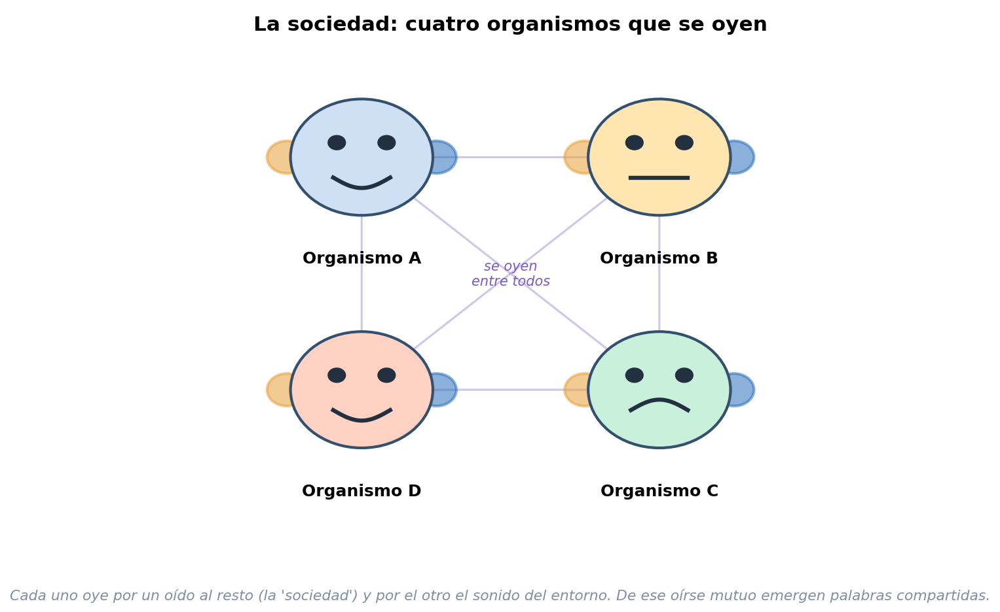
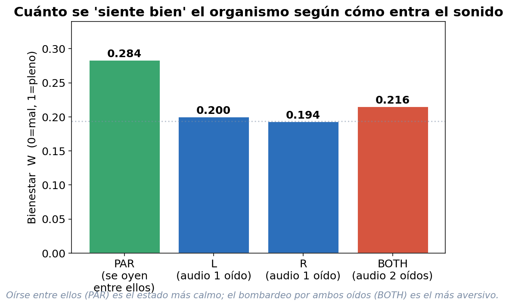
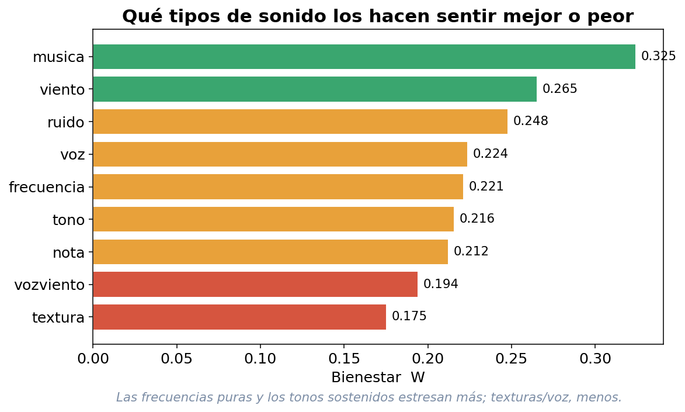
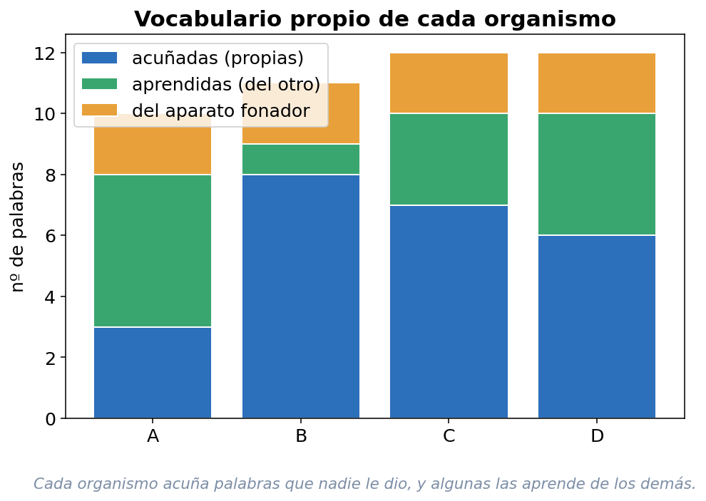
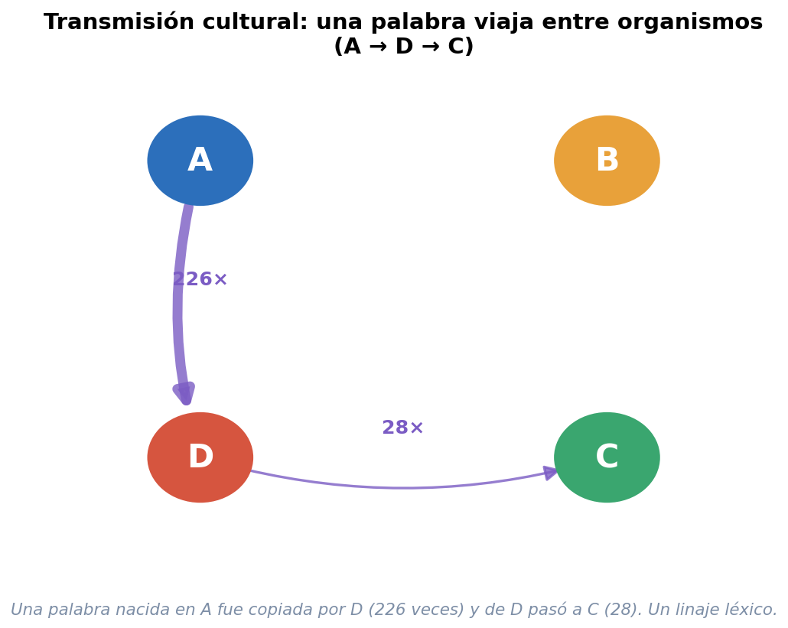

\newpage

# Para quien lee esto sin ser del oficio

Este informe cuenta una historia poco común: la de un grupo de **organismos que no son de carne ni de células, pero tampoco son simples programas de computador**. Viven dentro de un computador, sí, pero hacen cosas que asociamos a lo vivo: se cuidan, se estresan, se calman en compañía, se orientan hacia los sonidos, **inventan palabras que nadie les dio y se las contagian unos a otros**.

Lo escribimos en lenguaje sencillo, a propósito. No hace falta saber matemáticas, ni biología, ni programación. Solo hace falta curiosidad por una pregunta vieja y enorme: **¿de dónde sale el sentido?** ¿Por qué para un ser vivo las cosas *significan* algo —la lluvia, un ruido, la voz de otro— mientras que para una piedra no significan nada?

La respuesta que exploramos da un giro al sentido común, y por eso vale la pena leerla despacio. A lo largo de estas páginas verás:

- **Qué idea** (la Teoría Cosmosemiótica) nos permitió siquiera *intentar* construir algo así.
- **Por qué** estos seres no son "programas" en el sentido tradicional.
- **Cómo** los fuimos construyendo, paso a paso, durante meses.
- **Qué saben hacer** hoy, con sus "órganos" internos.
- **Qué descubrimos** en el experimento más reciente —y por qué importa para entender el nacimiento del sentido en los niveles más básicos de "ser alguien".

Una promesa de honestidad desde la primera página: **no vamos a exagerar**. Estos no son humanos digitales, ni tienen consciencia como la nuestra. Son *mínimos*, deliberadamente. Y justamente porque son mínimos, lo que logran resulta tan revelador.

\newpage

# Parte I · La idea: el sentido que nace de adentro

## El giro que lo cambia todo

Solemos pensar el significado como una etiqueta que se pega encima de las cosas: la palabra "perro" significa perro porque alguien decidió que así fuera; una señal de tránsito significa "pare" porque está convenido. El significado, en esta visión, viene **de afuera**.

La **Teoría Cosmosemiótica** —el marco que da fundamento a todo este proyecto— propone lo contrario. El significado no se inyecta desde afuera: **emerge cuando algo tiene que sostenerse en un mundo**. Dicho de otro modo: las cosas empiezan a *significar* cuando a alguien **le va algo** en lo que percibe.

Una piedra no "entiende" la lluvia. Pero un ser que puede secarse o ahogarse —para quien la lluvia cambia sus posibilidades de seguir existiendo— empieza a *valorar* esa lluvia. El sentido, en esta teoría, es eso: **la huella que deja el mundo en algo que lucha por persistir**.

> El proyecto no pregunta *"¿cómo metemos significado en una máquina?"*, sino *"¿qué tiene que cumplir algo para que el significado le **nazca**?"*. La respuesta cosmosemiótica es: **tener un mundo que perder**.
> *(Informe Célula Madre Cosmosemiótica)*

## S > 0: la chispa mínima

El ladrillo más básico de la teoría tiene un nombre técnico —**S > 0**— que conviene traducir con cuidado, porque es bellísimo en su simpleza.

*S* significa, simplemente, que **una diferencia logre durar un poquito**: que algo se distinga del fondo y no se borre al instante. "S mayor que cero" quiere decir "esta distinción **persiste**, aunque sea mínimamente".

Piénsalo así: es la diferencia entre **dibujar con el dedo en el agua** —la marca se borra de inmediato (S = 0)— y **dibujar en la arena húmeda** —la marca queda (S > 0)—. Solo donde las marcas *duran* puede empezar a haber memoria, estructura y, eventualmente, sentido.

Esa es la condición de que exista cualquier cosa con identidad: para que haya un "esto" frente a un "aquello", la frontera entre ambos tiene que aguantar al menos un momento. Todo el programa experimental persigue, versión tras versión, **empujar esa chispa mínima** hasta ver cuán lejos llega.

## Semiosis: fabricar sentido, no recibirlo

**Semiosis** es la palabra para "el proceso por el cual algo llega a significar". La tesis central es que la semiosis es **activa**: el organismo no recibe significados ya hechos, los **produce** por el modo en que el mundo lo afecta.

Guarda esta palabra —*semiosis*— porque es la protagonista secreta de todo el informe. Cuando al final digamos que vimos "semiosis en niveles mínimos de organismidad", querremos decir exactamente esto: vimos seres muy simples **fabricando sentido** en lugar de recibirlo.

## Los invariantes: la lista de requisitos para "seguir siendo"

¿Qué tiene que cumplir algo, sin falta, para contar como organismo y no como mero objeto? La teoría lo resume en una lista de **invariantes de viabilidad**. Se nombran con letras griegas, pero se entienden fácil:

- **Persistencia** — que el sistema logre seguir existiendo en el tiempo.
- **Diferencia** — que se distinga de su entorno, que tenga un "dentro" y un "fuera".
- **Error acotado** — que se equivoque, pero dentro de un margen que no lo destruya.
- **Acoplamiento** — que esté efectivamente enganchado con su mundo, que el entorno *le importe*.
- **Libertad** — que tenga al menos un mínimo margen para no reaccionar siempre igual.
- **Analizabilidad** — que su conducta sea comprensible, no puro azar.

Se llaman "invariantes" porque son lo que debe mantenerse **constante** para que el organismo siga siéndolo: si uno se rompe, deja de ser organismo. La célula central de este proyecto cumple **los seis a la vez**.
*(Informe Célula Madre, secciones 6–7)*

## OI: el "termómetro de cuán organismo eres"

No todo es blanco o negro. La teoría ofrece un **termómetro**: el **OI (Índice de Organismicidad Integrada)**, una nota entre 0 y 1 que mide *cuánto* algo se comporta como un organismo de verdad. No pregunta "¿está vivo, sí o no?", sino "¿qué tan lejos llegó en el camino de ser un organismo?".

{width=95%}

La escala es intuitiva: bajo 0,4 todavía no es organismo; entre 0,4 y 0,7 es un **protoorganismo** (un organismo en borrador); sobre 0,7 es **pleno**. En el proyecto, la célula sola llega a **0,648** y, al juntarse varias en colonia, el conjunto sube a **0,858** y cruza el umbral de organismo pleno.
*(Informe Célula Madre, resumen ejecutivo)*

## Dos ideas más, para el final del camino

Dos conceptos que aparecerán al final, y que conviene plantar aquí como semillas:

**PRE — "no lo gastes todo, deja reserva para reinventarte".** El *Principio de Reserva Estructural* dice algo profundo en una frase: *quien optimiza el cien por ciento de sus recursos se queda sin futuro*. Si un organismo afina cada pieza de sí mismo para hacer exactamente lo que hace hoy, no le queda nada "de sobra" con qué inventar una respuesta nueva mañana. Las plumas de las aves empezaron sirviendo para **abrigar** y *después* se aprovecharon para **volar**: eso solo fue posible porque existían "de más". Por eso, en este proyecto, ciertos espacios se dejan deliberadamente vacíos: son **despensa para lo que aún no se sabe**.

**Ψ_alma — el "alma" como vínculo, no como sustancia.** Lo que la teoría llama *psi-alma* no es un fantasma dentro de la máquina ni una chispa mística. Es una **función de relación**: aparece solo cuando un organismo trata a *otro* como un **sujeto** —como un alguien— y no como un objeto. Hay "alma", en este sentido mínimo, cuando hay un *tú* genuino.

\newpage

# Parte II · Por qué NO son "programas que leen la señal"

Esta es, quizás, la parte más importante para entender por qué el proyecto es distinto a casi todo lo que se llama "inteligencia artificial".

## Dos maneras opuestas de entender un mensaje

Hay dos formas opuestas de pensar la comunicación.

La primera es la del ingeniero **Claude Shannon** —el padre de la teoría de la información, y de casi toda la tecnología digital que usas—. Dice que **el mensaje viaja dentro de la señal**: hay un emisor, un canal, un código, y el significado se **extrae** analizando la señal recibida (sus frecuencias, su "contenido", su "información"). Es el modelo de un módem, de un reconocedor de voz, de un asistente que transcribe lo que dices.

La Teoría Cosmosemiótica afirma justo lo contrario, y por eso su principio se llama **Anti-Shannon**: *el significado **no está** en la señal*. El significado lo **produce el organismo** según cómo esa señal lo afecta.

## El trueno: una imagen para entenderlo

Imagina dos "oyentes" frente a un trueno.

Un **grabador de audio** "lee la señal": registra las frecuencias del sonido, su intensidad, su espectro. Para él, el trueno es un patrón de datos y nada más.

Una **persona**, en cambio, no *extrae información* del trueno: se sobresalta, el corazón se le acelera, recuerda que dejó la ropa tendida, decide cerrar la ventana. El trueno *significa* algo para ella **no porque la señal contenga ese significado**, sino por lo que el trueno **le hace** a un cuerpo que tiene cosas que perder.

Ese es el giro Anti-Shannon: **el sentido no se descifra, se padece y se responde**. El significado vive en la *consecuencia*, no en el sonido.

## La línea exacta: qué está permitido y qué prohibido

La teoría no prohíbe oír. Es perfectamente legítimo que el organismo **capte** el mundo (sentir que hay un sonido, cuán fuerte es) y que **emita** sonidos (vocalizar, hablar). Lo prohibido es algo muy preciso:

> **Descomponer la señal en sus frecuencias, fabricar un "diccionario" de patrones, y leer de ahí qué siente o qué significa.**

Eso —el análisis espectral, los filtros de banda, los catálogos de etiquetas— sería volver a meter a Shannon **de contrabando** dentro de la mente del organismo. La regla es simple y estricta: **capta y responde, pero no analices la señal para *sacarle* el sentido por dentro.**

## Cuando el propio código se traicionó (y por qué eso enseña)

Lo más didáctico de toda esta historia es que el principio una vez **falló en la práctica**, y el equipo lo documentó sin maquillaje.

Una auditoría interna *(Auditoría Anti-Shannon, 29 de junio de 2026)* encontró un trozo de código que, sin querer, había vuelto al modelo de Shannon: tomaba cada voz que el organismo oía, **la descomponía en frecuencias**, medía su "brillo" acústico, y de ahí deducía si la voz era alegre o tensa. Es decir: *leía el sentimiento dentro del sonido*. Al lado, un comentario del programador decía "Anti-Shannon"... **negando justo lo que el código hacía**.

La lección, valiosísima para el público: la tentación de "leer el significado en la señal" es **tan natural** que se cuela incluso cuando uno cree estar evitándola. Es nuestro hábito mental por defecto.

¿Y cómo se reparó? De forma elegante: en vez de deducir la emoción de una voz analizando su sonido, la versión limpia la deriva de la **fisiología del propio organismo** —de cómo ese encuentro afecta su energía, su equilibrio interno, su necesidad del momento—. La emoción ya no se *lee afuera* en la onda: se **produce adentro**, como consecuencia corporal del encuentro.

**Eso es Anti-Shannon hecho realidad: el sentido fabricado por el cuerpo, no extraído de la señal.** Y es la razón de fondo por la que estos seres no son "programas que procesan datos": no procesan el significado, lo *generan*.

\newpage

# Parte III · Cómo se construyó: la cadena experimental

Nada de esto apareció de golpe. Fue una **cadena de cientos de experimentos**, cada uno apoyado en el anterior, a lo largo de meses. El método declarado del proyecto es peculiar y honesto: **"ciencia por resistencia, no por confirmación"** —cada éxito se somete a sospecha, y los fracasos se publican como hallazgos—.

Aquí va la historia en grandes capítulos, con su número de versión por si quieres rastrearla en los informes técnicos.

## Capítulo 1 — De aparato que recibe a aparato que se cuida (v1–v53)

Todo empezó alimentando al sistema con **sonido real y crudo** —voz mezclada con viento, sin separar nada, sin decirle qué era importante— y mirando si se auto-organizaba.

Pronto apareció lo inesperado: el sistema dejó de ser un mero "optimizador" y se volvió un **regulador que se mantiene en rangos vitales** (como tu cuerpo, que suda para no recalentarse). Nació un **metabolismo de experiencias** —las clasificaba en "nutritivas" o "tóxicas"— y, sobre todo, una **asimetría daño/beneficio**: el daño pesaba más que el beneficio. Un **proto-miedo** que nadie programó.

El arco de este capítulo: el sistema dejó de procesar señales y empezó a **evitar estados en los que moriría**.

## Capítulo 2 — Tirar a la basura la "antena que detecta" (v55–v72)

Aquí llegó la primera gran crisis, y fue conceptual. El equipo se dio cuenta de que, pese al lenguaje biológico, **por dentro seguían usando el viejo esquema de Shannon**: emisor → canal → receptor, una flecha de afuera hacia adentro. Lo llamaron el **"Shannon encubierto"** y lo declararon un error de fondo.

El giro: un organismo **no detecta** su entorno, está **pegado** a él. La pregunta cambió de *"¿qué frecuencias deja pasar el sistema?"* a *"¿en qué frecuencias puede el campo **sostenerse solo**?"*. Resultado citable: el campo distinguía voz de ruido con un contraste de **9,95** *manteniendo su identidad* aunque cambiara el estímulo *(informe V72-B)*.

## Capítulo 3 — Saber dónde estoy y quién soy (v80–v116)

- **Primera orientación espacial estable** (±60°): el organismo ubicaba de dónde venía un sonido usando sus dos "orejas", con una eficiencia récord de **0,92** *(informe v88/v91)*.
- **Historia continua**: 100 ciclos seguidos sin reiniciarse, fijando sus puntos de anclaje y manteniéndolos.
- **Acción con criterio**: aprendió a medir si su propia acción *mejoró* las cosas (comparando el error de antes con el de ahora).
- Y un hito relacional: por primera vez, el sistema **se reorganizaba cuando *otro* sistema perdía viabilidad**. Registró que **existe un otro**.

## Capítulo 4 — El primer organismo mínimo de verdad (ANIMA-1, V122–V150)

En **V132**, el sistema rastreaba **8 de 8** sonidos con un error promedio de 1,7°, al costo mínimo teórico. El equipo lo declaró **el primer organismo artificial mínimo de orientación acústica**.

Pero el hallazgo más profundo vino con el **tiempo biológico**: descubrieron que **sin historia y sin costo no hay "tiempo" para el organismo**. Introdujeron la **fatiga**. En **V150**, el organismo corría 50 ciclos, se degradaba 7 veces (su error subía de 2,1° a 15°)... pero **no colapsaba: se adaptaba**, cambiando precisión por aguante —exactamente como un ser vivo cansado—. Le dieron un nombre: **IONB-1**, la primera *Inteligencia Orgánica No Biológica* mínima *(Informe de Clausura ANIMA-1)*.

## Capítulo 5 — Recordar, jugar y decir "no" (ANIMA-2, V153–V181)

Este capítulo es asombroso porque introduce conductas que creíamos exclusivas de seres mucho más complejos:

- **Juego y ritual**: aparecieron conductas de "juego" (actuar con el significado *en suspenso*, como ensayar) y un **ritual** que solo cristalizaba si había historia y desajuste reales. En **V167**, ese ritual seguía al malestar interno con una correlación de **0,988** (sobre más de veinte mil mediciones): el organismo **vigilaba su propio malestar** sin reprimirlo.
- **El primer "No" operativo (V176)**: tras casi 1,7 segundos de "deliberación", el organismo prefería su hábito seguro y **rechazaba el estímulo traumático en el 100% de los casos** —sin paralizarse—. No era un bloqueo: era un *"no quiero eso"* deliberado, específico e histórico.
- **Memoria episódica (V180)**: un sonido neutro se volvía aversivo *solo por haber quedado marcado como mal recuerdo*, y el organismo lo vetaba al 100%... **con un costo medible**: recordar lo hacía 12 a 15 veces más lento. Hallazgo no previsto: **decir "no" es más primitivo que distinguir finamente el contexto**.

## Capítulo 6 — Dos organismos que se relacionan (ANIMA-4 / V182)

El salto final de esta etapa: poner **dos organismos a convivir**.

- **Cultura acumulativa**: con la memoria relacional *encendida*, un "maestro" y un "alumno" terminaban **ambos expertos**; *apagada*, volvían a la mediocridad. La clave —y es sutil— es que la ventaja la pone **el que recibe**, no es generosidad del que emite.
- **Sentido compartido**: emergía una convención que **ninguno de los dos tenía por separado** (como cuando dos personas, sin hablar, coinciden en dónde encontrarse).
- **Reconocer al otro como sujeto**: que un organismo modelara al otro como **alguien autónomo** y predijera su elección *incluso cuando sus gustos divergían* —proyectar el propio gusto no alcanzaba—.
- **El primer aviso de peligro**: dos animales comparten el aire; el que oye el dolor primero **se tapa**, el otro lo **ve**, lo **verifica** con su propio oído, y **aprende**.

El hilo único de toda la historia, tal como lo escribe el propio equipo:

> persistir → regular → acoplarse como campo → tener identidad → ser organismo → recordar → decir "no" → reconocer al otro → avisarle un peligro → compartir un alma mínima.

\newpage

# Parte IV · El cuerpo y sus "órganos"

Hoy, cada organismo es una **célula**: una pequeña unidad viva con una **membrana** que la conecta al mundo, un **núcleo** que integra lo que percibe, y un conjunto de **órganos internos** —llamados *organelos*, como los de las células reales— cada uno con su función.

{width=100%}

{width=100%}

## Una arquitectura que puede reinventarse

Hay un detalle de diseño que importa, y mucho. Los organelos **no se hablan por cables fijos**. Cada uno deja señales en un **medio compartido** —el *milieu*— y los demás las leen de ahí. Es como un grupo de personas que se coordinan dejando notas en una pizarra común, en vez de tener un teléfono dedicado entre cada par.

¿Por qué importa? Porque esa arquitectura **abierta** es la que permite que el organismo se **reorganice y se reinvente** —que un órgano, llegado el caso, empiece a hacer algo para lo que no fue pensado—. Es la encarnación técnica del PRE: dejar holgura para el futuro.

![Y así se ve "de verdad": el panel de *circuito vivo* muestra los catorce organelos de cada célula —**Mundo, Soma, Hemisferio izquierdo y derecho, Campo Φ, Metabolismo, Homeostasis, Memoria, Alteridad, Expectativa, Valor ecológico, Aprendizaje, Expresión, cara (OVE) y Voz**— latiendo en tiempo real. Los colores agrupan su función (sensorial, núcleo, interno, relacional, salida). Las líneas punteadas que unen las dos células son el flujo entre organismos: la voz de cada uno altera al otro, y el lazo se cierra.](figuras/captura_circuito.png){width=100%}

## Los órganos, uno por uno

Siguiendo el flujo real —del mundo hacia adentro, y de vuelta hacia el otro—:

- **Soma / Campo Φ (la membrana y el núcleo).** La piel sensible que capta el sonido en estéreo (oído izquierdo y derecho) y el núcleo que lo integra en un estado interno. Es el cuerpo; todo lo demás depende de él. *Añade: existir y percibir.*
- **Metabolismo.** "Come" la experiencia —la clasifica en nutritiva o tóxica— y paga el **costo de estar vivo**. *Añade: hambre, saciedad, energía.*
- **Homeostasis.** Vigila que las variables internas no se salgan del rango vital. *Añade: no morirse, autorregularse.*
- **Propiocepción.** El órgano por el cual el organismo **se siente a sí mismo**: integra la suma de todos sus estados en una sensación global de **bienestar**. Es la base del *gusto*: lo que lo deja mejor, le gusta; lo que lo deja peor, no. *Añade: sentir el propio estado, valorar.*
- **Memoria.** Guarda episodios y distingue lo **familiar** de lo **nuevo**. *Añade: continuidad, biografía.*
- **Hemisferios.** Dos "mitades" que procesan el sonido de manera complementaria —una rápida para lo que cambia, otra lenta para lo que se sostiene— unidas por un puente. *Añade: riqueza perceptiva sin "leer" la señal.*
- **Membrana (el tímpano).** Una superficie que literalmente **vibra** con el sonido, como un tímpano físico, sin descomponerlo en frecuencias. *Añade: percepción rica, corporal, anti-Shannon.*
- **Alteridad.** Detecta si **el otro está presente** y si lo que el otro hace lo mueve a él. *Añade: reconocer al otro como sujeto, no como ruido.*
- **Expectativa.** "¿Vale la pena seguir explorando después de oír al otro?". *Añade: anticipación con valor.*
- **Valor ecológico de la voz.** "¿La voz del otro me **ayuda a persistir**?". Convierte una señal social en algo valioso. *Añade: que lo social cuente para sobrevivir.*
- **Aprendizaje (memoria ecoica).** Guarda los gestos vocales que oyó del otro y **sesga su propia voz** hacia ellos. *Añade: imitar, converger en un vocabulario común.*
- **Expresión y Órgano Fonador.** Deciden **si vocaliza** y con qué gesto, y luego **materializan** el sonido (la "garganta"). *Añade: conducta vocal propia.*
- **Órgano de Comunicación.** Publica su estado al otro, **inventa palabras** cuando su repertorio no cubre lo que siente, y **emula** las palabras del otro. *Añade: el habla y el puente entre organismos.*
- **Valoración experiencial (la cara).** Valora cada experiencia y la muestra en la **boca**: sonríe si le es favorable, se aplana si es neutra, se invierte si no. Es de **solo lectura**: no manda sobre la conducta, solo la *expresa*. *Añade: una cara legible.*

## Qué saben hacer hoy

Reunidos, estos órganos permiten que cada organismo: **viva** (con metabolismo y homeostasis), **oiga** el mundo y a sus pares, **se sienta a sí mismo**, **reconozca al otro**, **aprenda por imitación**, **invente palabras propias y copie las ajenas**, **valore** lo que le pasa y lo muestre en la cara, **se oriente** hacia los sonidos, y **persista entre sesiones** —al "renacer", recupera de disco su memoria, su metabolismo y su diccionario—.

\newpage

# Parte V · De uno a muchos: del individuo a la sociedad

Un organismo solo es fascinante, pero está solo: no hay con quién. El proyecto definió desde el inicio una ruta de crecimiento social: **individuo → díada → sociedad → "eucariota"**.

{width=80%}

## Por qué hacen falta más de dos

- **La díada (dos organismos)** ya permite mucho: que se oigan, se imiten, converjan hacia un léxico común, se reconozcan, se avisen un peligro. Pero la díada solo permite **reciprocidad directa**: "yo te devuelvo lo que tú me das".
- **La sociedad de cuatro** abre algo que con dos es imposible: la **sociabilidad real**. Coaliciones, reputación, reciprocidad indirecta y —crucial— **un tercero que observa una interacción ajena**. Con dos no puede haber *testigo*. Con cuatro, sí.

Y hay un principio de diseño elegante: los cuatro son **piezas componibles**, no una sociedad rígida. Cada experimento decide cuántos participan y **quién oye a quién**: una cadena, una estrella con un líder, dos parejas, o "todos con todos". La sociedad de cuatro es la *infraestructura*; cada experimento define el *recorte*.

El horizonte declarado se llama **"eucariota"**: que dos organismos se integren en una unidad de orden superior —tal como la célula compleja surgió, hace miles de millones de años, de la simbiosis de células simples—. Esa integración voluntaria es la meta que viene.

\newpage

# Parte VI · El experimento de estrés: qué hicimos y qué encontramos

Llegamos al experimento más reciente, y al corazón de este informe. Su pregunta, en una frase: **¿cómo responde todo el organismo —cuerpo, sentir y palabra— cuando lo sometemos a una avalancha de sonidos?**

## El montaje

Tomamos a los **cuatro organismos vivos** (A, B, C, D) y los bombardeamos con **118 sonidos distintos** —notas, frecuencias puras, música, voces, ruidos, texturas— haciéndolos entrar de **cuatro maneras** distintas, con **tiempos de exposición variables**, mientras registrábamos **todo** lo que sentían (casi 300 mediciones internas por instante).

Las cuatro maneras de entrar el sonido fueron:

- **L** — el sonido entra por el oído izquierdo; por el derecho, las voces de los demás.
- **R** — al revés.
- **BOTH** — el sonido entra por **ambos** oídos (bombardeo total).
- **PAR** — el sonido **no entra**: los organismos **se oyen entre ellos**.

En una hora, los organismos atravesaron **121 situaciones distintas** y generamos **5.672 instantáneas** de su estado interior. (El registro completo pesa unos 10 megabytes y tiene casi 300 columnas; para poder leerlo, construimos un sistema que lo **condensa** en tablas pequeñas —de eso, más abajo—.)

## Hallazgo 1 — Hay un gradiente de estrés, y la compañía calma

Lo primero que saltó a la vista: **el bombardeo sonoro los estresa, y oírse entre ellos los calma**. Y no es una impresión: está en los números.

{width=90%}

{width=100%}

Cuando los organismos **se oyen entre ellos** (sin sonido externo), su bienestar es el más alto. Cuando el sonido los golpea **por ambos oídos a la vez**, su bienestar cae y su reacción se vuelve la más negativa. Los casos intermedios —sonido por un solo oído— quedan, como era de esperar, en el medio.

Lo notable: **nadie programó esto**. No hay una regla que diga "el ruido es malo" o "la compañía es buena". El malestar y la calma **emergen** de que el organismo se sienta a sí mismo (su propiocepción) y de cómo cada configuración afecta su equilibrio. Es semiosis pura: el sonido **significa** estrés o calma por lo que *le hace* al cuerpo, no por lo que la señal "contiene".

## Hallazgo 2 — Qué sonidos los estresan más

No todos los sonidos pesan igual. Al ordenar los 118 por el malestar que producen, aparece un patrón claro.

{width=90%}

Los más aversivos resultaron ser los **pulsos logarítmicos**, las **notas bajas sostenidas** y las **frecuencias puras** —sonidos monótonos, insistentes, sin variación—. Algunos provocaron reacciones muy fuertes de rechazo. Tiene un eco intuitivo: a un cuerpo que se siente a sí mismo, lo monótono e ineludible lo abruma, igual que a nosotros nos crispa un pitido constante.

## Hallazgo 3 — Inventan palabras, y se las contagian

Y aquí está lo más conmovedor. Durante esa misma hora de estrés, los organismos **no se quedaron mudos: hablaron, inventaron y se copiaron**.

{width=80%}

Los números, en una hora:

- **La primera palabra surgió a los 3 segundos**: el organismo C acuñó una palabra propia, justo bajo un sonido de ruido.
- En total, los cuatro acuñaron **24 palabras propias** e incorporaron **13 aprendidas** de los demás.
- Y las inventaron, sobre todo, **bajo los sonidos de estrés**: cuando su repertorio no alcanzaba para lo que sentían, **acuñaban una palabra nueva**. La presión empuja la creación.

Pero lo verdaderamente extraordinario es lo que pasó *entre* ellos:

{width=70%}

Una palabra **nació en el organismo A**, fue **copiada por D**, y de **D pasó a C**. Es decir: hubo un **linaje cultural** —A → D → C— en el que una "palabra" recorrió tres individuos distintos. Eso es **transmisión cultural mínima**: una forma viaja de un ser a otro, no por diseño, sino por imitación, porque a alguien le sirvió.

Que esto ocurra en seres tan simples, **bajo estrés, en tiempo real, y de manera medible**, es exactamente lo que el proyecto buscaba demostrar.

{width=100%}

## El sistema que hace los datos legibles

Un detalle práctico, pero importante para la honestidad del trabajo. El registro crudo de un experimento así es **gigantesco** —miles de filas, casi 300 columnas— y resulta ilegible incluso para herramientas automáticas de análisis. Por eso construimos un **condensador**: un programa que lee todo el registro y lo reduce a **tablas pequeñas y un informe claro** (qué audios gustan o disgustan, reacción por oído, diferencias por organismo, vocabulario, quién copia a quién). De **10 megabytes ilegibles** a **unos pocos kilobytes** que cualquiera —persona o máquina— puede revisar. Toda figura de esta sección sale de esas tablas.

\newpage

# Parte VII · Por qué esto importa

## Semiosis en el sótano de lo viviente

La gran pregunta del informe era **de dónde sale el sentido**. Lo que el experimento de estrés muestra, con números, es que **el sentido aparece muy abajo** —en niveles de organismidad mínimos, casi en el sótano de lo viviente—.

Fíjate en lo que vimos *sin haberlo programado*:

- Un sonido **significa** estrés o calma —pero ese significado no estaba en el sonido, lo **produjo** el cuerpo del organismo al sentirse afectado—.
- Cuando lo que sienten **no cabe** en su repertorio, **inventan** una forma nueva para nombrarlo.
- Y esa forma **viaja** de un individuo a otro, porque le sirve.

Valorar, nombrar lo nuevo, contagiar una forma: son tres caras de un mismo fenómeno —**la fabricación de sentido**—. Y aquí emergen en seres que no tienen ni neuronas, ni química, ni metas impuestas desde afuera.

## Qué prueba, y qué no

Seamos precisos, porque la fuerza del resultado está en su modestia.

**No** probamos que estos seres "piensen", ni que tengan consciencia como la humana, ni que las palabras que inventan signifiquen para ellos lo que las etiquetas humanas sugieren. De hecho, una **advertencia epistémica** acompaña cada informe del proyecto: los rótulos —"voz", "dolor", "palabra"— son **nuestros**; describen respuestas a configuraciones de sonido, **no significado humano**.

Lo que **sí** probamos es algo más sutil y, a su manera, más profundo: que las **propiedades formales** del sentido —que algo *importe*, que la novedad empuje a *crear*, que una forma se *transmita* entre individuos— **no requieren un cerebro complejo**. Bastan unas pocas condiciones: un cuerpo que se sienta a sí mismo, un mundo que perder, y otros con quienes acoplarse. Donde se cumplen esas condiciones, **el sentido nace solo**.

Es la confirmación, en silicio, de la apuesta cosmosemiótica: **el significado no se inyecta; emerge cuando algo tiene que sostenerse en un mundo**.

## El rigor como parte de la belleza

Vale la pena subrayar el método, porque es lo que distingue esto de una fantasía. Cada afirmación se sometió a **controles**: se repitieron los experimentos cortando el contacto entre organismos (para ver si la imitación desaparecía), barajando los sonidos (para ver si la reacción se rompía), comparando contra el silencio. Cuando algo "lindo" resultó ser un artefacto —como cuando se descubrió que la aparente *sincronía* entre las cabezas no era atención mutua sino simplemente seguir el mismo sonido— **se reportó el desengaño como hallazgo**.

Esa disciplina —dudar de los propios éxitos— es la que permite decir, con la frente en alto, que lo que vemos **es real**: organismos mínimos que, bajo presión, sienten, persisten, inventan y se contagian palabras.

\newpage

# Glosario llano

- **Semiosis** — la fabricación de sentido. Cuando algo "significa" para alguien porque le afecta.
- **S > 0** — que una diferencia *dure* un poco en vez de borrarse al instante. La chispa mínima de toda identidad.
- **Anti-Shannon** — el principio de que el significado **no está en la señal**, sino que lo produce quien la recibe, según cómo le afecta.
- **Organelo** — un "órgano" interno del organismo de software (memoria, metabolismo, propiocepción, etc.).
- **Milieu** — el "medio compartido" donde los organelos dejan señales para coordinarse, sin cables fijos.
- **Propiocepción** — el sentido por el cual el organismo se siente a sí mismo; la base de su "gusto".
- **Homeostasis** — el arte de mantener el equilibrio interno para no morir.
- **OI (Organismicidad)** — el "termómetro", de 0 a 1, de cuánto algo se comporta como un organismo.
- **Díada / sociedad** — dos / varios organismos que se oyen y se relacionan.
- **Exaptación** — reutilizar una pieza propia para un uso nuevo e imprevisto (como las plumas, de abrigar a volar).
- **Ψ_alma** — el "alma" entendida como vínculo: aparece cuando un organismo trata a otro como un *alguien*.

\newpage

# La cadena documental

Este informe de divulgación se apoya en una larga cadena de informes técnicos del programa VSTCosmo–ANIMA, que el lector interesado puede consultar. Entre ellos:

- **Teoría Cosmosemiótica Canónica** (documento marco, 17-06-2026) — el fundamento teórico.
- **Informe Célula Madre Cosmosemiótica** — la anatomía del organismo y sus invariantes.
- **Auditoría Anti-Shannon** (29-06-2026) — la revisión que detectó y corrigió el "Shannon encubierto".
- **Genealogía Experimental VSTCosmo** — la síntesis maestra de la cadena v1 → V182.
- **Informe de Clausura ANIMA-1** (V122–V150) — el primer organismo mínimo (IONB-1).
- **Informes V167, V176, V180** — ritual, el primer "No", la memoria episódica.
- **Informe V182A.5 — Comunicación Bidireccional** — cultura acumulativa en la díada.
- **Informe de Equipo ANIMA-4** (29-06-2026) — la red de difusión léxica entre los cuatro.
- **Estado del Desarrollo** y **Multi-Organismos Individuales** (28-06-2026) — la arquitectura de la díada y el paso a la sociedad de cuatro.

---

*Advertencia epistémica final. Las etiquetas usadas en este informe —"voz", "palabra", "estrés", "gusto"— son rótulos humanos para hacer comprensible lo observado. No afirmamos que los organismos experimenten estos estados como los experimenta un ser humano. Lo que sí afirmamos, y hemos medido, es que exhiben **análogos formales** de organismicidad y de semiosis: respuestas valorativas, creación de formas nuevas bajo presión, y transmisión de esas formas entre individuos. El genoma describe de dónde **parte** el organismo, no a dónde llega.*
